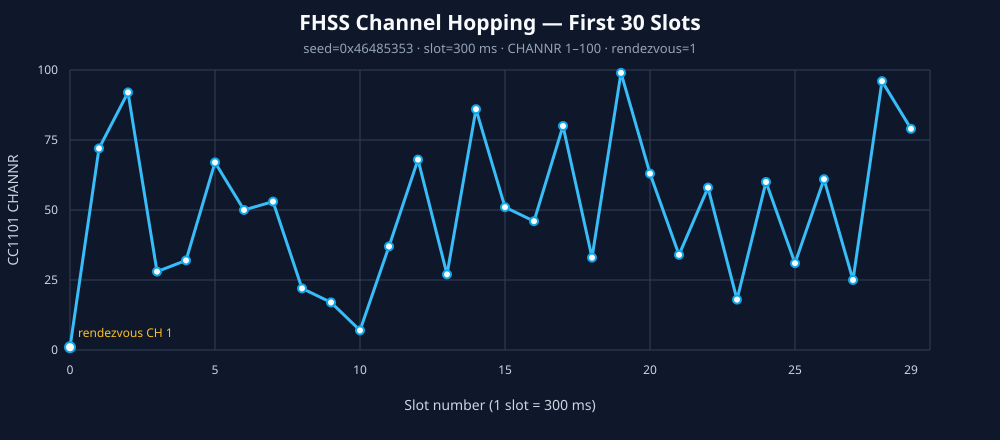

# FHSS 채널 이동 발표 자료



이 그래프는 factory-default 조건으로 처음 30개 슬롯을 계산한 결과다. 최신
develop에서 NVS의 OTA FHSS 설정이 활성화되어 있으면 seed, 채널 범위와 slot 시간이
달라질 수 있으므로 실제 발표 검증은 아래 실시간 모니터 값을 기준으로 한다.

- 공통 seed: `0x46485353`
- 슬롯 길이: `300 ms`
- 후보 채널: CC1101 `CHANNR 1~100`
- 시작 채널: rendezvous `CHANNR 1`
- 전체 표시 시간: `30 × 300 ms = 9초`

처음 30개 채널은 다음과 같다.

```text
1, 72, 92, 28, 32, 67, 50, 53, 22, 17,
7, 37, 68, 27, 86, 51, 46, 80, 33, 99,
63, 34, 58, 18, 60, 31, 61, 25, 96, 79
```

## 발표 설명 예시

> 통신 시작 전에는 양쪽 장치가 공통 rendezvous 채널 1에서 만납니다. 첫 SYNC로
> 슬롯과 시간 기준을 맞춘 다음, 양쪽이 같은 seed와 slot 번호를 사용해 동일한
> 다음 채널을 계산합니다. 그래프의 한 점이 300ms 슬롯 하나이며, 선이 위아래로
> 이동하는 것이 실제 CC1101의 CHANNR 변경입니다. 채널 순서를 무선으로 매번
> 전송하는 것이 아니라 동일한 입력으로 양쪽이 독립적으로 같은 결과를 계산합니다.

그래프가 주파수 자체가 아니라 `CHANNR`를 표시한다는 점에 유의한다. 실제 주파수는
CC1101의 기준 주파수와 channel spacing 설정을 함께 적용해 결정된다.

## 시연 로그와 함께 보여줄 값

```text
channel selected: slot=0 channel=1
channel selected: slot=1 channel=72
channel selected: slot=2 channel=92
```

TX와 RX 모니터에서 동일한 slot과 channel이 나란히 출력되면 synchronized hopping이
동작한다는 직접적인 증거가 된다.

## 실시간 발표 모니터

`tools/fhss_live_channel_monitor.html`은 두 ESP32의 serial log를 직접 읽어 TX/RX
채널을 실시간으로 겹쳐 그린다. 별도 Python 패키지는 필요 없다.

프로젝트 루트에서 실행:

```powershell
python -m http.server 8000
```

Chrome 또는 Edge에서 다음 주소를 연다.

```text
http://localhost:8000/tools/fhss_live_channel_monitor.html
```

1. 기존 `idf.py monitor`를 모두 종료해 COM 포트 점유를 해제한다.
2. `TX 포트 연결`을 눌러 송신 보드 COM 포트를 선택한다.
3. `RX 포트 연결`을 눌러 수신 보드 COM 포트를 선택한다.
4. 두 보드를 COMM 모드로 두고 TX 보드에서 PTT를 누른다.
5. 두 선이 같은 slot/channel을 가리키고 상단에 `SYNCHRONIZED`가 표시되는지 본다.

브라우저가 COM 포트를 직접 점유하므로 이 도구와 ESP-IDF monitor를 같은 포트에
동시에 연결할 수 없다.
