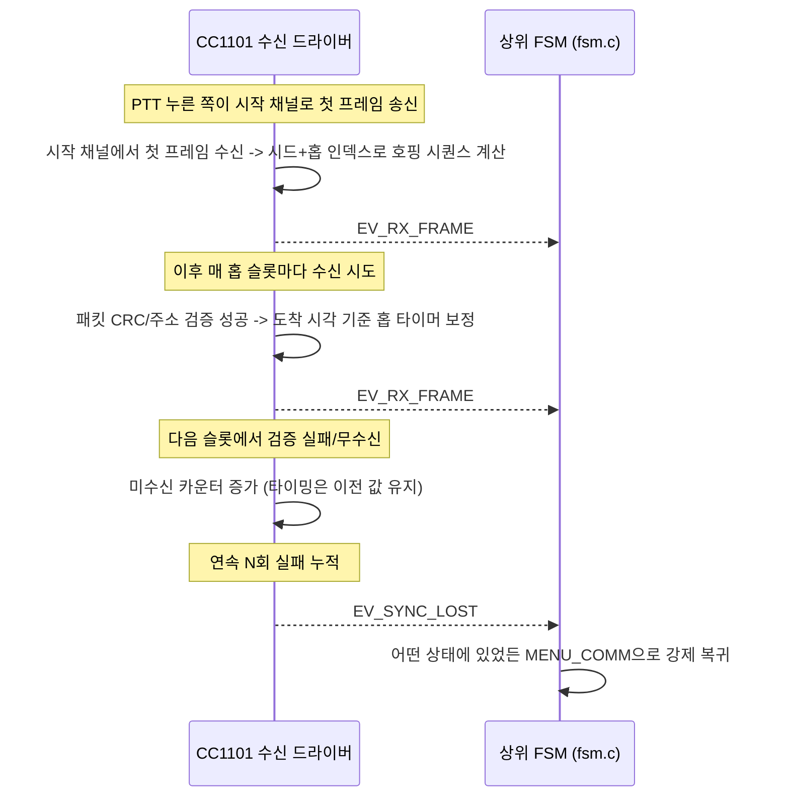
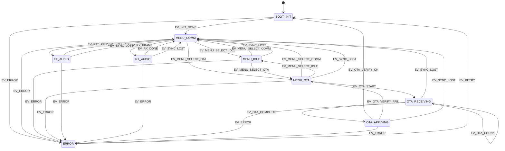

# 무선기 단말 통합 FSM 설계

ESP32-S3 무선기 단말(`firmware-esp32`)의 최상위 애플리케이션 상태기계 설계 문서. FHSS 음성 통신과 OTA 수신, PTT/OLED/마이크/스피커/로터리엔코더 UX를 하나의 상태기계로 통합한다.

## 한눈에 보기

| 상태 | 한 줄 요약 |
|---|---|
| `BOOT_INIT` | 부팅, 주변장치 초기화 |
| `MENU_COMM` | 통신 대기 (기본 메뉴, 정해진 시작 채널에서 대기) |
| `MENU_IDLE` | 뮤트 (통신도 OTA도 아님, 수신 처리 없음) |
| `MENU_OTA` | OTA 대기 (사용자가 로터리로 진입) |
| `TX_AUDIO` | 음성 송신 중 |
| `RX_AUDIO` | 음성 수신 중 |
| `OTA_RECEIVING` | OTA 청크 수신 중 |
| `OTA_APPLYING` | OTA 이미지 검증·적용 중 |
| `ERROR` | 복구 불가 오류 |

상세 설명은 [§2 상태](#2-상태-states), 전이 규칙은 [§4 상태 전이표](#4-상태-전이표) 참고.

## 결정 이력

| 날짜 | 결정 | 이유 / 트레이드오프 |
|---|---|---|
| 2026-08-04 | nRF24L01 폐기, **CC1101 하나**로 음성 FHSS + OTA 수신 겸용 | 두 칩이 같은 보드 위에 있어 이원화 실익 없음. 반이중 트랜시버라 음성·OTA 동시 수신 불가 → [§1 하드웨어 공유](#하드웨어-공유) |
| 2026-08-04 | 로터리 엔코더로 `MENU_IDLE`/`MENU_OTA` **수동 선택**, 활동 중 전환 잠금 | 의도치 않은 OTA 수신/플래싱 방지가 우선. 트레이드오프: "1:N 동시 업데이트"는 각 단말이 사전에 `MENU_OTA`로 전환돼 있어야 성립(운영 절차 전제) → [§1 메뉴 게이팅](#메뉴-게이팅) |
| 2026-08-05 | `rf_transport`/`fhss_core` 없는 동안 `FHSS_SYNC` 자동 통과용 임시 bypass **넣지 않음** | `FSM_EVENT_SYNC_ACQUIRED`를 인위로 쏘면 마치 동기화가 동작하는 것처럼 보여 나중에 놓치기 쉬움. 대가로 `MENU_IDLE`/`MENU_OTA`(PTT·로터리 와이어링 포함) 실기기 end-to-end 테스트는 `rf_transport` 생기기 전까지 불가, 컴파일·개별 컴포넌트 검증까지만 가능 |
| 2026-08-06 | `TX_AUDIO`는 캡처(`audio_io`) 태스크까지만 와이어링, `RX_AUDIO`는 완전히 TODO로 유지 | 송신은 마이크 입력만 있으면 되지만(rf_transport로 보내는 지점만 TODO), 수신 재생은 상대가 보낸 프레임 바이트가 `fsm_event_t`에 실려올 방법이 없어(페이로드 없는 enum) 지금 채우면 추측 코드가 됨. `rf_transport` 설계 시 이벤트에 데이터 전달 방법도 같이 정해야 함 |
| 2026-08-06 | `fsm_event_t`는 그대로 페이로드 없는 enum으로 유지, 오디오 프레임은 **별도 큐**(`fsm_post_rx_audio_frame()`)로 전달 | 모든 이벤트에 페이로드 필드를 넣으면 이벤트 큐 항목 크기가 전부 커짐(오디오만 필요한데). 큐 분리로 기존 이벤트 큐는 가볍게 유지하면서 RX_AUDIO 데이터 경로(디코딩+재생)는 실제로 연결. 다만 그 큐를 채워줄 호출자(`rf_transport`)와 `RX_DONE` 발생 시점은 여전히 미정 — 위 §6 참고 |
| 2026-08-06 | `RX_AUDIO` 무음 타임아웃 **1초**로 확정, `rx_audio_task`가 자체 판정해 `FSM_EVENT_RX_DONE` 발생 | PTT_RELEASE 같은 명시적 종료 신호가 RX 쪽엔 없어서 무음/타임아웃 기반으로 결정. `rf_transport` 없이는 실제 프레임 유입이 없어 이 값이 실측 검증된 건 아님 — 실기기 연동 후 짧은 발화 사이 끊김/긴 침묵 오탐 여부 보고 조정 필요 |
| 2026-08-10 | 브로드캐스트 방식으로 FHSS 설계 변경: `FSM_STATE_FHSS_SYNC`/`FSM_EVENT_SYNC_ACQUIRED` **제거**, `BOOT_INIT` → `MENU_IDLE` 직행 | "동기를 먼저 잡고 운용 시작"이 아니라 "정해진 시작 채널에서 대기하다가, PTT 누른 쪽이 먼저 송신하면서 시드 기반 호핑 시작 + 받는 쪽은 그 수신 시점 기준으로 추종"하는 구조로 확정. 별도 획득 대기 상태 자체가 불필요해짐. `FSM_EVENT_SYNC_LOST`는 전역 안전장치 이벤트로 유지(무선 계층이 호핑 추종 실패 판단 시 `MENU_IDLE`로 강제 복귀시키는 용도) — 팀5의 `fhss_sync_state`(SEARCHING/LOCKED, N회 연속 성공/실패 카운팅) 모듈이 이 이벤트의 소스가 될 후보. `ACQUIRED` 쪽은 더 이상 FSM에 필요 없어져 fhss_core 내부용으로만 남을 전망(팀5 확인 필요) |
| 2026-08-11 | OLED UI를 세로(좌측 90도 회전)로 재설계, 메뉴를 **3-way(COMM/IDLE/OTA)**로 확장 — 기존 `MENU_IDLE`(통신 대기)을 `MENU_COMM`으로 개명하고, `MENU_IDLE`을 완전히 새로운 **뮤트** 상태로 재정의 | 사용자가 제시한 화면 목업(좌상단 "mode" 라벨 + COMM/IDLE/OTA 세 박스, 선택 항목은 배경/글자색 반전, 커서는 흰 테두리) 기준으로 설계. 배선(SDA/SCL)은 그대로 두고 소프트웨어에서 좌표 변환으로 회전(SSD1306엔 90도 회전 명령이 없음). "뮤트" 상태는 PTT/RX_FRAME 전이가 없어 통신도 OTA도 아닌 완전한 대기 상태 — 실수로 무전이 울리는 걸 막고 싶을 때 씀. `rotary_encoder_menu_t`/`display_ui_menu_item_t`도 3-way로 확장(순서: COMM/IDLE/OTA, 화면 표시 순서와 일치) |
| 2026-08-12 | Qt 앱의 OTA 스캔 응답용 `EV_OTA_DISCOVER_RX` 추가 — **상태 전이 없이** `MENU_OTA`에서만 ACK(`device_id`+펌웨어 버전)를 준비하는 부수효과 이벤트로 설계 | OTA_DISCOVER(2바이트: version/type)를 받으면 기기가 자신의 고유번호로 응답해야 하는데, 이건 "다른 상태로 넘어가는 것"이 아니라 "같은 상태에서 반응만 하는 것"이라 전이표(§4)에 넣지 않고 `fsm_task()`가 `EV_ERROR`/`EV_SYNC_LOST`처럼 전이표 조회 전에 특별 처리(단, 전역이 아니라 `MENU_OTA`로 스코프 한정). ACK 페이로드는 `components/device_id`(MAC 뒤 3바이트)와 `main/firmware_version.h`(major/minor/patch)를 그대로 사용 — 새 버전 개념을 만들지 않음. 실제 RF 송수신은 `rf_transport`가 없어 여전히 TODO, 인터페이스(`fsm_post_ota_discover_frame()`)만 먼저 정의 |
| 2026-08-12 | `on_enter_error()` 구현 — LED 빨간 점멸(`status_led_start_error_blink()`)+OLED "ERROR" 상태 줄, TX_AUDIO/RX_AUDIO 태스크 정리 | 그동안 빈 스텁이라 `EV_ERROR`가 와도 화면상 아무 반응이 없었음. `EV_ERROR`는 전역 전이라 TX_AUDIO/RX_AUDIO 도중에도 올 수 있어 `on_enter_menu_comm()`과 동일한 오디오 태스크 정리를 넣어야 "안전 상태로 정지"가 실제로 보장됨. `status_led`에 점멸 API(`esp_timer` 기반, `display_ui`의 상태 애니메이션과 동일 패턴)를 새로 추가 |

## 1. 설계 전제

#### 하드웨어 공유
- 음성(FHSS)과 OTA가 물리적으로 같은 라디오(CC1101, 단일 트랜시버)를 공유한다. 하나의 반이중(half-duplex) 트랜시버가 동시에 음성 홉 수신과 OTA 브로드캐스트 수신을 둘 다 할 수 없다는 **하드웨어 제약**이다.
- `OTA_RECEIVING` 진입 시 CC1101은 음성 호핑 스케줄을 이탈해 OTA 수신 채널로 재동조(retune)하며, 그동안은 음성 송수신이 물리적으로 불가능하다.

#### 메뉴 게이팅 (3-way)
- 메뉴 모드(`MENU_COMM`/`MENU_IDLE`/`MENU_OTA`)는 수신 해석을 게이팅하는 최상위 상태이며, 활동 중(음성 송수신/OTA 수신·적용)에는 전환할 수 없다. `MENU_COMM`=음성 통신, `MENU_IDLE`=뮤트(수신 처리 없음), `MENU_OTA`=OTA 대기.
- 로터리 엔코더 클릭으로 메뉴를 확정하는 이벤트(`EV_MENU_SELECT_COMM`/`EV_MENU_SELECT_IDLE`/`EV_MENU_SELECT_OTA`)는 이 세 상태끼리만 정의되어 있고, `TX_AUDIO`/`RX_AUDIO`/`OTA_RECEIVING`/`OTA_APPLYING` 상태에는 이 전이 자체가 없다. 즉 "메뉴 변경 불가"는 **전이표에 해당 이벤트를 정의하지 않는 것만으로 자연히 보장**된다 (해당 상태에서 이 이벤트가 들어오면 그냥 무시).
- 로터리 회전(커서 이동)은 FSM 이벤트가 아니다. 화면에 COMM/IDLE/OTA 중 무엇에 커서(흰 테두리)가 있는지는 `display_ui` 컴포넌트가 그리는 로컬 상태일 뿐이며, 클릭(확정) 시점에만 그때 커서가 있던 항목에 해당하는 이벤트가 FSM에 올라온다.

#### 브로드캐스트 호핑과 `EV_SYNC_LOST`(안전장치)
- "동기를 먼저 잡고 나서 운용 시작"하는 별도 상태가 없다. 평소엔 모든 단말이 정해진 시작 채널에서 `MENU_COMM`으로 대기하고 있고, PTT 누른 쪽이 그 채널로 먼저 송신하면서 그 순간부터 결정론적 시드 기반으로 호핑을 시작한다. 받는 쪽은 그 수신 시점을 기준 삼아 같은 시드로 호핑을 추종한다(팀5, `fhss_core`). 부팅 직후엔 곧바로 `MENU_COMM`으로 들어간다 — 자세한 내용은 [§1.1](#11-동시성-모델-fhss-홉-추종-vs-최상위-fsm) 참고.
- `EV_SYNC_LOST`는 여전히 전역(global) 이벤트로 남아있지만, 역할이 "재탐색 상태로 전이"가 아니라 **"MENU_COMM(정해진 채널)으로 강제 복귀"**로 바뀌었다. 무선 계층이 호핑 추종 중 연속 미수신 등으로 타이밍이 완전히 깨졌다고 판단하면 이 이벤트를 올리고, 현재 어떤 최상위 상태에 있든(설령 `TX_AUDIO`/`RX_AUDIO` 도중이라도) `MENU_COMM`으로 강제 전이한다. 정상적인 세션 종료(`TX_AUDIO`의 `PTT_RELEASE`, `RX_AUDIO`의 `RX_DONE`)와는 별개의, 이상 상황 전용 탈출구다. (뮤트 상태인 `MENU_IDLE`이 아니라 `MENU_COMM`으로 돌아가는 이유: 안전장치는 "다시 정상 통신 가능한 상태"로 복귀시키는 게 목적이지, 무전을 뮤트시키는 게 목적이 아님)
- 미수신 카운팅은 `OTA_RECEIVING`/`OTA_APPLYING` 동안 정지한다. CC1101이 이 두 상태에서는 애초에 의도적으로 음성 호핑 스케줄을 벗어나 OTA 채널을 듣고 있으므로, 그 사이 음성 슬롯을 못 받는 것은 "동기 상실"이 아니다.
- 치명적 오류(`EV_ERROR`)도 전역 이벤트로, 어느 상태에서든 `ERROR` 상태로 강제 전이한다.

### 1.1 동시성 모델: FHSS 홉 추종 vs 최상위 FSM

이 문서의 상태기계(§2~§4, `fsm.c`)는 **애플리케이션 동작 모드**만 표현한다. 홉 타이밍 유지는 별도의 상시 실행 태스크가 프리러닝 타이머로 도는 것이 **아니라**, CC1101 수신 경로(패킷 핸들러) 안에 내장된 로직이다:

1. PTT 누른 쪽이 정해진 시작 채널로 먼저 송신 → 그 순간부터 시드 기반으로 호핑 시작.
2. 받는 쪽은 시작 채널에서 그 첫 프레임을 수신하면, 그 도착 시각과 패킷에 실린 홉 인덱스/슬롯 번호(`fhss_sync_packet_t`)를 기준으로 같은 시드의 호핑 시퀀스를 계산해 따라간다.
3. **이후 매 패킷이 도착해 CRC/주소 검증에 성공하면**, 그 즉시 그 패킷의 실제 도착 시각을 기준으로 다음 홉 타이머(슬롯 시작 시각)를 재정렬한다 — 이게 "타이밍 유지"다.
4. **패킷 검증에 실패하거나 아예 수신되지 않으면**, 내부 카운터만 증가시키고 이전 타이밍을 그대로 유지(추정)한다. 이 카운터가 임계값(연속 N회 미수신/검증 실패)을 넘기면 그때 비로소 "완전히 놓쳤다"고 판정하고 `EV_SYNC_LOST`를 올려 `MENU_COMM`(정해진 채널)으로 강제 전이한다. (팀5의 `fhss_sync_state` 모듈이 이 판정 로직의 후보 — `SEARCHING`/`LOCKED` 상태와 연속 성공/실패 카운팅으로 `LOST` 이벤트를 냄)

즉 보정 자체는 `TX_AUDIO`/`RX_AUDIO` 등 실제 호핑이 일어나는 세션 동안 수신 이벤트에 얹혀 자연히 일어나며, FSM은 이를 이벤트로 인지하지 않는다 — FSM이 신경 쓰는 것은 세션의 정상 종료(`PTT_RELEASE`/`RX_DONE`)와 완전히 놓쳤을 때(`EV_SYNC_LOST`) 두 가지뿐이다.

## 2. 상태 (States)

| 상태 | 설명 | 담당(스펙 기준) |
|---|---|---|
| `BOOT_INIT` | 전원 인가 직후. I2S(마이크/스피커), OLED, 로터리 엔코더, SPI(CC1101), PTT 버튼 GPIO 초기화 | 팀1, 팀2 |
| `MENU_COMM` | **통신 모드**, 정해진 시작 채널에서 PTT 입력 또는 음성 수신 프레임 대기. 부팅 직후 기본(default) 진입 상태. 수신 패킷은 음성으로 해석됨 | 팀1, 팀5 |
| `MENU_IDLE` | **뮤트 모드**. 통신도 OTA도 아님 — PTT/수신 프레임에 대한 전이가 없어 무전이 완전히 대기만 함 | 팀1 |
| `MENU_OTA` | **OTA 대기 모드**. 수신 패킷은 펌웨어 청크로 해석되며 ACK/재전송 로직 수행 대상이 됨. 로터리 엔코더로 사용자가 명시적으로 진입해야 함(자동 진입 없음) | 팀1, 팀2 |
| `TX_AUDIO` | PTT 눌림 (`MENU_COMM`에서만 발생). 마이크 캡처 → Speex 인코딩 → FHSS 채널 송신 | 팀1, 팀2 |
| `RX_AUDIO` | 상대 단말로부터 음성 프레임 수신 중 (`MENU_COMM`에서만 발생) → Speex 디코딩 → 스피커 재생 | 팀1, 팀2 |
| `OTA_RECEIVING` | (`MENU_OTA`에서만 발생) 게이트웨이가 CC1101로 브로드캐스트한 OTA 청크 수신·버퍼링 | 팀2 |
| `OTA_APPLYING` | 수신 완료된 이미지 검증(체크섬) 및 OTA 파티션 기록, 재부팅 대기 | 팀2 |
| `ERROR` | 복구 불가 수준의 하드웨어/통신 오류. 로깅 후 재시도 또는 재부팅 대기 | 팀1(PM) |

## 3. 이벤트 (Events)

| 이벤트 | 발생 주체 | 설명 |
|---|---|---|
| `EV_INIT_DONE` | 부팅 시퀀스 | 주변장치 초기화 완료 |
| `EV_SYNC_LOST` | CC1101 수신 태스크 (홉 로직, 팀5) | 호핑 추종 실패(연속 미수신 등)로 완전히 놓침 — `MENU_COMM`으로 강제 복귀 (전역, 안전장치) |
| `EV_MENU_SELECT_COMM` | 로터리 엔코더 클릭 핸들러 | 클릭 시점에 커서가 COMM에 있었으면 발생 (`MENU_IDLE`/`MENU_OTA`에서 유효) |
| `EV_MENU_SELECT_IDLE` | 로터리 엔코더 클릭 핸들러 | 클릭 시점에 커서가 IDLE에 있었으면 발생 (`MENU_COMM`/`MENU_OTA`에서 유효) |
| `EV_MENU_SELECT_OTA` | 로터리 엔코더 클릭 핸들러 | 클릭 시점에 커서가 OTA에 있었으면 발생 (`MENU_COMM`/`MENU_IDLE`에서 유효) |
| `EV_PTT_PRESS` / `EV_PTT_RELEASE` | PTT 버튼 ISR/디바운스 태스크 | 송신 시작/종료 (`MENU_COMM`에서만 유효) |
| `EV_RX_FRAME` | CC1101 수신 태스크 | 음성 프레임 도착 (`MENU_COMM` 상태에서 수신 시) |
| `EV_RX_DONE` | `rx_audio_task`(`main/fsm.c`) | 수신 무음 타임아웃(1초, `FSM_RX_AUDIO_IDLE_TIMEOUT_MS`)으로 수신 종료 |
| `EV_OTA_DISCOVER_RX` | CC1101 수신 태스크 (`fsm_post_ota_discover_frame()`) | Qt 앱의 OTA_DISCOVER 스캔 패킷(2바이트) 수신. **상태 전이 없음** — `MENU_OTA`일 때만 `fsm_task()`가 특별 처리해 ACK(`device_id`+펌웨어 버전) 준비, 그 외 상태면 무시 |
| `EV_OTA_START` | CC1101 수신 태스크 | 게이트웨이 OTA 헤더 패킷 감지 (`MENU_OTA` 상태에서 수신 시) |
| `EV_OTA_CHUNK` | CC1101 수신 태스크 | OTA 이미지 청크 수신 |
| `EV_OTA_COMPLETE` | CC1101 수신 태스크 | 마지막 청크 수신, 전체 이미지 확보 |
| `EV_OTA_VERIFY_OK` / `EV_OTA_VERIFY_FAIL` | OTA 적용 로직 | 체크섬/서명 검증 결과 |
| `EV_ERROR` | 임의 모듈 | 치명적 오류 (전역) |
| `EV_RETRY` | 사용자 조작 또는 워치독 | ERROR 상태에서 재시도 |

## 4. 상태 전이표

| 현재 상태 | 이벤트 | 다음 상태 | 비고 |
|---|---|---|---|
| `BOOT_INIT` | `EV_INIT_DONE` | `MENU_COMM` | 별도 동기 획득 대기 없이 곧바로 기본 메뉴(통신)로 진입 |
| `MENU_COMM` | `EV_PTT_PRESS` | `TX_AUDIO` | |
| `MENU_COMM` | `EV_RX_FRAME` | `RX_AUDIO` | |
| `MENU_COMM` | `EV_MENU_SELECT_IDLE` | `MENU_IDLE` | 로터리 클릭으로 메뉴 전환 |
| `MENU_COMM` | `EV_MENU_SELECT_OTA` | `MENU_OTA` | 로터리 클릭으로 메뉴 전환 |
| `MENU_IDLE` | `EV_MENU_SELECT_COMM` | `MENU_COMM` | 로터리 클릭으로 메뉴 전환 |
| `MENU_IDLE` | `EV_MENU_SELECT_OTA` | `MENU_OTA` | 로터리 클릭으로 메뉴 전환 |
| `MENU_OTA` | `EV_MENU_SELECT_COMM` | `MENU_COMM` | 로터리 클릭으로 메뉴 전환 |
| `MENU_OTA` | `EV_MENU_SELECT_IDLE` | `MENU_IDLE` | 로터리 클릭으로 메뉴 전환 |
| `MENU_OTA` | `EV_OTA_START` | `OTA_RECEIVING` | CC1101이 OTA 채널로 재동조, 음성 호핑 이탈 |
| `TX_AUDIO` | `EV_PTT_RELEASE` | `MENU_COMM` | |
| `RX_AUDIO` | `EV_RX_DONE` | `MENU_COMM` | |
| `OTA_RECEIVING` | `EV_OTA_CHUNK` | `OTA_RECEIVING` | self-loop, 버퍼 적재 |
| `OTA_RECEIVING` | `EV_OTA_COMPLETE` | `OTA_APPLYING` | |
| `OTA_APPLYING` | `EV_OTA_VERIFY_OK` | `BOOT_INIT` | 이미지 스왑 후 재부팅 |
| `OTA_APPLYING` | `EV_OTA_VERIFY_FAIL` | `MENU_OTA` | 이미지 폐기, 기존 펌웨어 유지, 재시도 위해 OTA 대기 모드 유지 (※ 확정 필요 — `MENU_COMM`으로 되돌릴지 재검토 가능) |
| **모든 상태** | `EV_SYNC_LOST` | `MENU_COMM` | 전역 전이, 안전장치(이상 상황 전용) |
| **모든 상태** | `EV_ERROR` | `ERROR` | 전역 전이 |
| `ERROR` | `EV_RETRY` | `BOOT_INIT` | |

`EV_OTA_DISCOVER_RX`는 이 표에 없다 — 상태를 바꾸지 않는(같은 상태에서 ACK만 준비하는) 부수효과 이벤트라서, self-transition을 넣어도 `fsm_transition_to()`가 `next_state==s_state`를 no-op 처리해 enter action이 안 불린다. 대신 `fsm_task()`가 `EV_ERROR`/`EV_SYNC_LOST`와 같은 자리(전이표 조회 **전**)에서 `s_state == MENU_OTA`일 때만 특별 처리한다 — 전역이 아니라 `MENU_OTA`로 스코프가 좁다는 점만 다르다. `MENU_OTA`가 아닌 상태에서 들어오면 이 특별 처리에 안 걸리고 전이표 조회로 넘어가는데, 거기에도 해당 항목이 없어 그냥 unhandled로 무시된다(로그만 찍힘).

`TX_AUDIO`/`RX_AUDIO`/`OTA_RECEIVING`/`OTA_APPLYING` 상태에는 `EV_MENU_SELECT_COMM`/`EV_MENU_SELECT_IDLE`/`EV_MENU_SELECT_OTA`에 대한 전이가 **정의되어 있지 않다** — 활동 중 메뉴 변경 이벤트가 들어와도 무시된다는 뜻이며, 이것이 곧 "SW적으로 메뉴 변경 불가" 요구사항의 구현이다. 같은 이유로, 음성 통화 중(`TX_AUDIO`/`RX_AUDIO`)에는 애초에 `MENU_OTA`가 아니므로 `EV_OTA_START`가 발생해도(패킷이 음성으로 오인되거나 무시되므로) `OTA_RECEIVING`으로 끼어들 수 없다 — 이전 설계에 있던 "음성 통화를 OTA가 강제 인터럽트"하는 전이는 폐기됐다.

## 5. 상태 다이어그램

`fsm.c`에 실제 구현된 최상위 상태만 평면으로 그린 뷰. FHSS 홉 추종 병행 프로세스는 상태가 아니므로 여기 나타나지 않는다 (§1.1 참고).

## 6. 구현 매핑

- 코드: [`main/fsm.h`](../main/fsm.h), [`main/fsm.c`](../main/fsm.c) — 테이블 기반 상태기계, FreeRTOS 큐로 이벤트 수신. **이 파일은 애플리케이션 동작 모드만 다루며, FHSS 홉 타이밍 보정 자체는 구현하지 않는다.**
  - `MENU_COMM`/`MENU_IDLE`/`MENU_OTA` 3-way, `FSM_EVENT_MENU_SELECT_COMM`/`IDLE`/`OTA`는 `fsm.h`/`fsm.c`/전이표에 반영 완료.
  - `display_ui`/`ptt_button`/`rotary_encoder` wiring도 `fsm.c`의 `on_enter_boot_init()`(각 컴포넌트 init + 콜백 등록)에 반영 완료.
  - `audio_io`/`audio_codec` wiring 완료: `on_enter_boot_init()`에서 `audio_codec_init()`/`audio_io_init()` 호출, `on_enter_tx_audio()`가 캡처(`audio_io_capture_encode()`) 태스크를 시작하고 `on_enter_menu_comm()`(PTT_RELEASE로 도달)에서 정리. 인코딩된 프레임을 실제로 보낼 `rf_transport`가 없어 그 지점만 TODO.
  - **RX_AUDIO 데이터 경로 연결 완료(2026-08-06)**: `fsm_event_t`(페이로드 없는 enum)와 별개로 오디오 프레임 전용 큐(`s_rx_audio_queue`, 깊이 4)를 추가하고, `fsm_post_rx_audio_frame(data, len)` API를 새로 노출(`main/fsm.h`). 이 함수를 호출하면 프레임을 큐에 넣고 `FSM_EVENT_RX_FRAME`도 함께 올린다. `on_enter_rx_audio()`는 큐를 소비해 `audio_io_decode_play()`로 재생하는 태스크를 시작하고, `on_enter_menu_comm()`에서 정리한다(TX_AUDIO 캡처 태스크와 대칭 구조).
    - **미정 1**: `fsm_post_rx_audio_frame()`을 실제로 호출해줄 곳이 아직 없음 — `rf_transport`가 생겨서 수신 프레임을 검증한 뒤 이 함수를 호출해야 데이터가 흐름.
    - **`FSM_EVENT_RX_DONE` 종료 조건 확정(2026-08-06)**: `rx_audio_task`가 큐 대기를 `FSM_RX_AUDIO_IDLE_TIMEOUT_MS`(1초)로 제한 — 그 안에 새 프레임이 안 오면 수신 종료로 보고 스스로 `FSM_EVENT_RX_DONE`을 올리고 태스크 종료. `rf_transport`가 아직 없어 실제 프레임이 안 들어오므로, 지금은 이 타임아웃이 검증되지 않은 채 값만 정해둔 상태 — 실기기 연동 후 1초가 적절한지 재검토 필요.
  - `rf_transport`가 필요한 `ota_*`는 해당 컴포넌트가 없어 아직 TODO — 지금 채우면 실제 API 없이 추측성 코드가 되므로 의도적으로 비워둠.
  - **OTA 스캔 ACK 구조 선반영(2026-08-12)**: Qt 앱 -> ESP `OTA_DISCOVER`(2바이트, `components/ota_client/include/ota_discover_packet.h`)를 `fsm_post_ota_discover_frame(data, len)`로 디코드해 성공 시 `FSM_EVENT_OTA_DISCOVER_RX`를 올린다(`fsm_post_rx_audio_frame()`과 동일 패턴 — 실 호출자는 `rf_transport` 생기기 전까지 없음). `fsm_task()`가 이 이벤트를 `MENU_OTA` 상태에서만 특별 처리(`handle_ota_discover_ack()`)해 `components/device_id`(MAC 뒤 3바이트) + `main/firmware_version.h`(major/minor/patch)를 담은 `OTA_DISCOVER_ACK`(6바이트)를 인코딩까지만 해둔다 — 실제 RF 송신은 TODO(팀2).
  - **`FHSS_SYNC` 상태/`SYNC_ACQUIRED` 이벤트 제거(2026-08-10)**: 브로드캐스트 설계로 바뀌면서 별도 동기 획득 대기 상태가 불필요해짐 — `FSM_STATE_FHSS_SYNC` 삭제, `BOOT_INIT`의 `EV_INIT_DONE`이 곧바로 기본 메뉴로 전이. `on_enter_fhss_sync()` 함수도 제거. `FSM_EVENT_SYNC_ACQUIRED`도 더 이상 FSM이 소비하지 않아 `fsm.h`에서 제거. `FSM_EVENT_SYNC_LOST`는 전역 안전장치로 유지.
  - **메뉴 3-way 확장 + OLED 회전(2026-08-11)**: `FSM_STATE_MENU_IDLE`(기존, 통신 대기)을 `FSM_STATE_MENU_COMM`으로 개명하고, `FSM_STATE_MENU_IDLE`을 완전히 새로운 **뮤트** 상태로 재정의(PTT_PRESS/RX_FRAME 전이 없음 — TX_AUDIO/RX_AUDIO로 못 들어감). `on_enter_menu_idle()`(옛 이름)은 `on_enter_menu_comm()`으로 개명, 오디오 태스크 정리 로직 그대로 유지. 새 `on_enter_menu_idle()`은 화면만 다시 그리는 최소 구현(TX_AUDIO/RX_AUDIO로 들어오는 전이가 없어 정리할 태스크가 있을 수 없음). `FSM_EVENT_SYNC_LOST`의 복귀 목적지도 `MENU_IDLE`에서 `MENU_COMM`으로 변경(뮤트가 아니라 정상 통신 대기로 복귀해야 하므로). 화면은 `display_ui_draw_menu(selected, hovered)`로 매 전이/커서 이동마다 다시 그림 — `fsm.c`에 `menu_item_from_fsm_state()`/`menu_item_from_rotary()` 매핑 헬퍼 추가(`display_ui`는 FSM을 모르므로 fsm.c가 변환).
  - **`on_enter_error()` 구현(2026-08-12)**: `EV_ERROR`(전역 전이)로 들어오면 `s_tx_audio_task`/`s_rx_audio_task`가 돌고 있었을 경우(`on_enter_menu_comm()`과 동일한 로직) 정리하고, `status_led_start_error_blink()`(빨간 점멸, `components/status_led`에 새로 추가한 `esp_timer` 기반 API)와 `display_ui_set_status("ERROR")`로 표시. 유일한 탈출구 `EV_RETRY -> BOOT_INIT`에서 `on_enter_boot_init()`이 점멸/상태 텍스트를 정리(`status_led_stop_error_blink()`/`display_ui_clear_status()`, 반드시 `*_init()` 호출 다음에 — 냉부팅 시 아직 없는 핸들에 접근하면 크래시). 다만 `on_enter_boot_init()`의 각 `*_init()`은 여전히 냉부팅 전용 가정이라 `EV_RETRY` 재진입 시 이미 초기화된 드라이버를 다시 초기화하려다 실패할 수 있음 — 별개 이슈로 TODO(팀1/PM) 남겨둠.
- 음성 FHSS 홉 타이밍 보정과 OTA 수신은 **같은 CC1101 SPI 드라이버/태스크**(팀2+팀5 공동) 안에서 모드 전환으로 구현한다. 홉 타이밍 보정은 별도의 프리러닝 타이머 태스크가 아니라 **수신 이벤트 처리 로직에 내장**되며, 연속 N회 수신 실패로 완전히 놓쳤다고 판정될 때만 `FSM_EVENT_SYNC_LOST`를 `fsm_post_event()`로 올린다(§1 참고 — 팀5의 `fhss_sync_state` 모듈이 이 판정의 후보). 정상적인 매 수신 성공은 FSM에 이벤트로 올라오지 않는다. `OTA_RECEIVING` 진입/이탈 시 이 태스크는 음성 호핑 스케줄 추종을 명시적으로 멈추고/재개한다. **수신 패킷을 음성/OTA 중 무엇으로 해석할지는 이 태스크가 현재 메뉴 모드(`fsm_get_state()`가 `MENU_COMM`인지 `MENU_OTA`인지)를 참조해 결정한다.**
- 로터리 엔코더 태스크(`components/rotary_encoder`, 팀1)는 회전 시 로컬 커서만 갱신(FSM 이벤트 없음, `fsm.c`가 이를 받아 `display_ui_draw_menu()`로 흰 테두리만 갱신), 클릭 시 그 시점 커서에 해당하는 `FSM_EVENT_MENU_SELECT_COMM`/`IDLE`/`OTA`를 `fsm_post_event()`로 올린다.
- 각 모듈(PTT 버튼 태스크, 로터리 엔코더 태스크, CC1101 수신 태스크, OTA 적용 로직)은 하드웨어 이벤트 발생 시 `fsm_post_event()`만 호출하고, 실제 상태 전이/부수효과는 FSM 태스크 하나에서만 처리한다 (경쟁 상태 방지).
- 상태 진입/이탈 시 수행할 하드웨어 동작(마이크 시작/정지, OLED 상태 표시 등)은 `fsm.c`의 `on_enter_*` 스텁에 각 담당 팀이 채워 넣는다.
