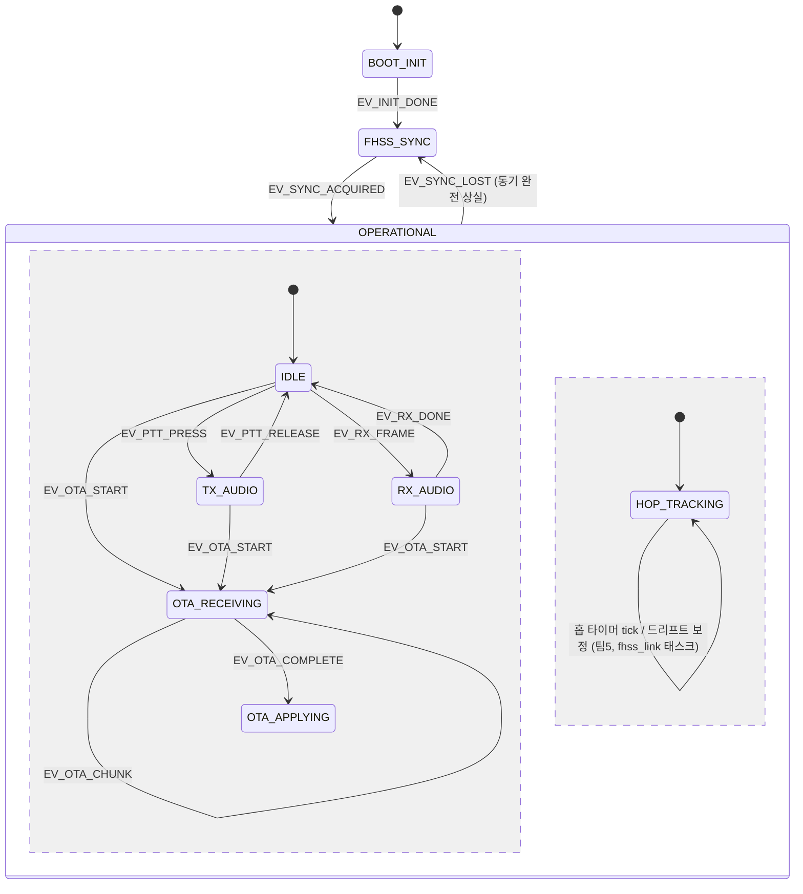
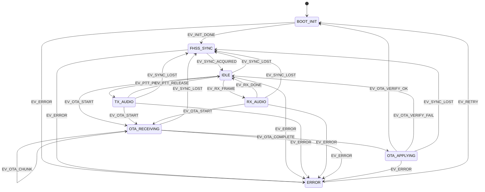

# 무선기 단말 통합 FSM 설계

ESP32-S3 무선기 단말(`firmware-esp32`)의 최상위 애플리케이션 상태기계 설계 문서. PROJECT_SPEC.md 기준 FHSS 음성 통신(nRF24L01), OTA 수신(CC1101), PTT/OLED/마이크/스피커 UX를 하나의 상태기계로 통합한다.

## 1. 설계 전제

- 음성 링크(nRF24L01, 2.4GHz)와 OTA 링크(CC1101, Sub-GHz)는 서로 다른 RF 모듈을 쓰지만, 같은 CPU/플래시를 공유한다. OTA 이미지 기록(flash write) 중에는 실시간 오디오 처리가 지터를 겪을 수 있으므로, **OTA 수신·적용 중에는 음성 송수신을 일시 중단**하는 것을 기본 정책으로 한다.
- **`FHSS_SYNC` 상태 ≠ 홉 유지(hop maintenance).** `FHSS_SYNC`는 "아직 동기가 없는" 두 경우에만 존재한다: (1) 최초 부팅 후 최초 동기 획득, (2) 동기를 완전히 잃어 재획득이 필요한 경우. 일단 동기가 잡히면(`EV_SYNC_ACQUIRED`) 이후의 홉 추종·타이밍 드리프트 보정은 **이 최상위 FSM과 별개로 항상 병행 실행되는 프로세스**(FHSS 태스크, 팀5 담당)가 맡는다. 즉 홉 추종은 `IDLE`/`TX_AUDIO`/`RX_AUDIO`/`OTA_*` 어떤 상태에서도 끊기지 않고 계속 돈다 — 애초에 RX_AUDIO로 프레임을 받을 수 있는 것 자체가 홉 추종이 그 순간에도 맞물려 돌고 있기 때문이다. 자세한 동시성 구조는 [§1.1](#11-동시성-모델-fhss-홉-추종-vs-최상위-fsm) 참고.
- `EV_SYNC_LOST`는 위 (2)의 "동기 완전 상실"에서만 발생하는 전역(global) 이벤트다. 이 경우에는 현재 어떤 최상위 상태에 있든(설령 RX_AUDIO 도중이라도) 통신 자체가 불가능해지므로 강제로 `FHSS_SYNC`로 전이한다. 미세한 타이밍 오차 보정은 이벤트로 올라오지 않고 FHSS 태스크 내부에서 조용히 처리된다.
- 치명적 오류(`EV_ERROR`)도 전역 이벤트로, 어느 상태에서든 `ERROR` 상태로 강제 전이한다.

### 1.1 동시성 모델: FHSS 홉 추종 vs 최상위 FSM

이 문서의 상태기계(§2~§4, `fsm.c`)는 **애플리케이션 동작 모드**만 표현한다. FHSS 홉 시퀀스를 계속 따라가는 일(주파수 테이블 인덱스 증가, 슬롯 타이밍 정렬, 드리프트 보정)은 별도의 상시 실행 태스크(가칭 `fhss_link`)가 담당하며, 이 FSM의 "상태"가 아니라 `FHSS_SYNC → (상태 무관하게 계속 실행)` 형태의 병행 프로세스다.

`OPERATIONAL` 안의 두 영역(위: 동작 모드, 아래: `HOP_TRACKING`)은 서로 독립적으로 동시에 활성화된다. `RX_AUDIO`에 있는 동안에도 `HOP_TRACKING`은 계속 돌고 있으며, 이 둘은 배타 관계가 아니다.

## 2. 상태 (States)

| 상태 | 설명 | 담당(스펙 기준) |
|---|---|---|
| `BOOT_INIT` | 전원 인가 직후. I2S(마이크/스피커), OLED, SPI(nRF24L01, CC1101), PTT 버튼 GPIO 초기화 | 팀1, 팀2 |
| `FHSS_SYNC` | 피어/네트워크와 주파수 호핑 동기 **획득/재획득**. 최초 부팅 시, 또는 동기를 완전히 잃었을 때만 진입한다. 동기 유지(홉 추종)는 이 상태가 아니라 [§1.1](#11-동시성-모델-fhss-홉-추종-vs-최상위-fsm)의 병행 프로세스가 담당 | 팀5 |
| `IDLE` | 동기 완료, 호핑 시퀀스를 따라가며 PTT 입력 또는 수신 프레임 대기 | 팀1, 팀5 |
| `TX_AUDIO` | PTT 눌림. 마이크 캡처 → Opus 인코딩 → FHSS 채널 송신 | 팀1, 팀2 |
| `RX_AUDIO` | 상대 단말로부터 음성 프레임 수신 중 → Opus 디코딩 → 스피커 재생 | 팀1, 팀2 |
| `OTA_RECEIVING` | 게이트웨이가 CC1101로 브로드캐스트한 OTA 청크 수신·버퍼링 | 팀2 |
| `OTA_APPLYING` | 수신 완료된 이미지 검증(체크섬) 및 OTA 파티션 기록, 재부팅 대기 | 팀2 |
| `ERROR` | 복구 불가 수준의 하드웨어/통신 오류. 로깅 후 재시도 또는 재부팅 대기 | 팀1(PM) |

## 3. 이벤트 (Events)

| 이벤트 | 발생 주체 | 설명 |
|---|---|---|
| `EV_INIT_DONE` | 부팅 시퀀스 | 주변장치 초기화 완료 |
| `EV_SYNC_ACQUIRED` | FHSS 모듈 | 호핑 동기 획득 |
| `EV_SYNC_LOST` | FHSS 모듈 | 호핑 동기 상실 (전역) |
| `EV_PTT_PRESS` / `EV_PTT_RELEASE` | PTT 버튼 ISR/디바운스 태스크 | 송신 시작/종료 |
| `EV_RX_FRAME` | nRF24L01 수신 ISR | 상대방 음성 프레임 도착 |
| `EV_RX_DONE` | 오디오 태스크 | 수신 무음 타임아웃 등으로 수신 종료 |
| `EV_OTA_START` | CC1101 수신 태스크 | 게이트웨이 OTA 헤더 패킷 감지 |
| `EV_OTA_CHUNK` | CC1101 수신 태스크 | OTA 이미지 청크 수신 |
| `EV_OTA_COMPLETE` | CC1101 수신 태스크 | 마지막 청크 수신, 전체 이미지 확보 |
| `EV_OTA_VERIFY_OK` / `EV_OTA_VERIFY_FAIL` | OTA 적용 로직 | 체크섬/서명 검증 결과 |
| `EV_ERROR` | 임의 모듈 | 치명적 오류 (전역) |
| `EV_RETRY` | 사용자 조작 또는 워치독 | ERROR 상태에서 재시도 |

## 4. 상태 전이표

| 현재 상태 | 이벤트 | 다음 상태 | 비고 |
|---|---|---|---|
| `BOOT_INIT` | `EV_INIT_DONE` | `FHSS_SYNC` | |
| `FHSS_SYNC` | `EV_SYNC_ACQUIRED` | `IDLE` | |
| `IDLE` | `EV_PTT_PRESS` | `TX_AUDIO` | |
| `IDLE` | `EV_RX_FRAME` | `RX_AUDIO` | |
| `IDLE` | `EV_OTA_START` | `OTA_RECEIVING` | 음성 대기 중단 |
| `TX_AUDIO` | `EV_PTT_RELEASE` | `IDLE` | |
| `TX_AUDIO` | `EV_OTA_START` | `OTA_RECEIVING` | 송신 강제 종료(OTA 우선) |
| `RX_AUDIO` | `EV_RX_DONE` | `IDLE` | |
| `RX_AUDIO` | `EV_OTA_START` | `OTA_RECEIVING` | 수신 강제 종료(OTA 우선) |
| `OTA_RECEIVING` | `EV_OTA_CHUNK` | `OTA_RECEIVING` | self-loop, 버퍼 적재 |
| `OTA_RECEIVING` | `EV_OTA_COMPLETE` | `OTA_APPLYING` | |
| `OTA_APPLYING` | `EV_OTA_VERIFY_OK` | `BOOT_INIT` | 이미지 스왑 후 재부팅 |
| `OTA_APPLYING` | `EV_OTA_VERIFY_FAIL` | `IDLE` | 이미지 폐기, 기존 펌웨어 유지 |
| **모든 상태** | `EV_SYNC_LOST` | `FHSS_SYNC` | 전역 전이 |
| **모든 상태** | `EV_ERROR` | `ERROR` | 전역 전이 |
| `ERROR` | `EV_RETRY` | `BOOT_INIT` | |

## 5. 상태 다이어그램

`fsm.c`에 실제 구현된 최상위 상태만 평면으로 그린 뷰. FHSS 홉 추종 병행 프로세스는 상태가 아니므로 여기 나타나지 않는다 (§1.1 참고).

## 6. 구현 매핑

- 코드: [`main/fsm.h`](../main/fsm.h), [`main/fsm.c`](../main/fsm.c) — 테이블 기반 상태기계, FreeRTOS 큐로 이벤트 수신. **이 파일은 애플리케이션 동작 모드만 다루며, FHSS 홉 추종 자체는 구현하지 않는다.**
- FHSS 홉 추종(주파수 인덱스 증가, 슬롯 타이밍, 드리프트 보정)은 팀5가 별도 모듈(가칭 `fhss_link.c`)과 상시 실행 태스크로 구현한다. 이 태스크는 동기를 처음 잡으면 `FSM_EVENT_SYNC_ACQUIRED`를, 재획득 불가 수준으로 동기를 완전히 잃으면 `FSM_EVENT_SYNC_LOST`를 `fsm_post_event()`로 올리는 것 외에는 최상위 FSM과 독립적으로 계속 동작한다.
- 각 모듈(PTT 버튼 태스크, nRF24L01 수신 태스크, CC1101 수신 태스크, FHSS 동기 로직)은 하드웨어 이벤트 발생 시 `fsm_post_event()`만 호출하고, 실제 상태 전이/부수효과는 FSM 태스크 하나에서만 처리한다 (경쟁 상태 방지).
- 상태 진입/이탈 시 수행할 하드웨어 동작(마이크 시작/정지, OLED 상태 표시 등)은 `fsm.c`의 `on_enter_*` 스텁에 각 담당 팀이 채워 넣는다.
