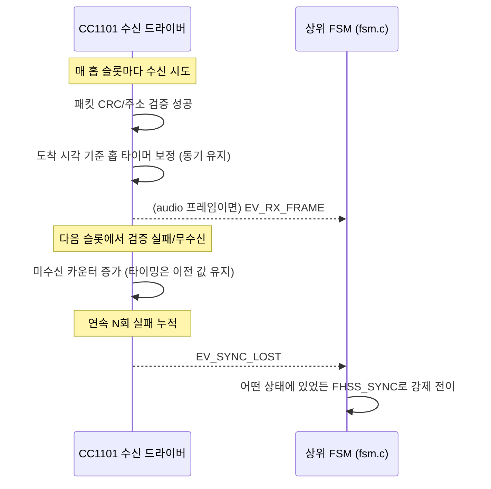
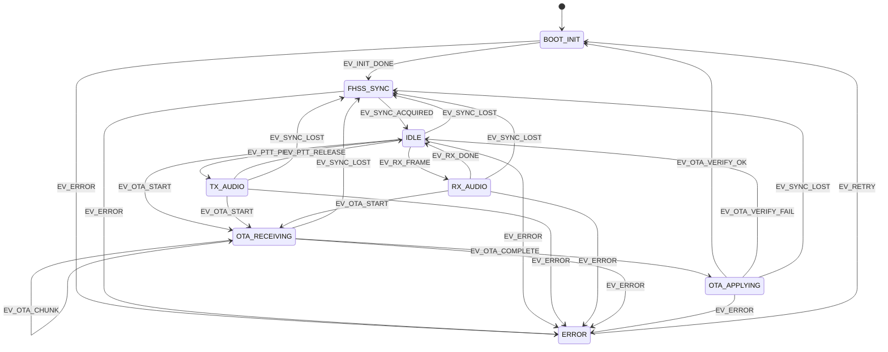

# 무선기 단말 통합 FSM 설계

ESP32-S3 무선기 단말(`firmware-esp32`)의 최상위 애플리케이션 상태기계 설계 문서. FHSS 음성 통신과 OTA 수신, PTT/OLED/마이크/스피커 UX를 하나의 상태기계로 통합한다.

> **HW 변경 (2026-08-04 확정)**: nRF24L01과 CC1101이 같은 단말 보드에 위치하는 구성이라, 현재는 **RF 통신(음성 FHSS + OTA 수신)을 모두 CC1101 하나로** 처리하는 것으로 우선 진행한다. nRF24L01 이원화는 보류(추후 재검토 대상)이며, 이 문서의 상태/이벤트 설계는 CC1101 단일 라디오 기준으로 작성됐다. PROJECT_SPEC.md의 HW 구성표(2개 RF 모듈)는 아직 이 결정을 반영하지 않은 상태다.

## 1. 설계 전제

- **음성(FHSS)과 OTA가 물리적으로 같은 라디오(CC1101, 단일 트랜시버)를 공유한다.** 이전 설계에서는 서로 다른 RF 모듈(nRF24L01 vs CC1101)이라 "정책적으로" 배타 처리했지만, 이제는 하나의 반이중(half-duplex) 트랜시버가 동시에 음성 홉 수신과 OTA 브로드캐스트 수신을 둘 다 할 수 없다는 **하드웨어 제약**이다. 따라서 `OTA_RECEIVING` 진입 시 CC1101은 음성 호핑 스케줄을 이탈해 OTA 수신 채널로 재동조(retune)하며, 그동안은 음성 송수신이 물리적으로 불가능하다.
- **`FHSS_SYNC` 상태 ≠ 홉 타이밍 보정.** `FHSS_SYNC`는 "아직 동기가 없는" 두 경우에만 존재한다: (1) 최초 부팅 후 최초 동기 획득, (2) 연속 수신 실패로 동기를 완전히 잃어 재획득(재탐색)이 필요한 경우. 일단 동기가 잡히면(`EV_SYNC_ACQUIRED`) 이후의 타이밍 유지는 **별도 태스크가 계속 도는 방식이 아니라, 매 수신 패킷 검증에 성공할 때마다 그 자리에서 보정하는 이벤트 기반(event-driven) 방식**이다. 자세한 내용은 [§1.1](#11-동시성-모델-fhss-홉-추종-vs-최상위-fsm) 참고.
- `EV_SYNC_LOST`는 위 (2), 즉 "기대되는 수신 윈도우에서 연속 N회 유효 패킷을 받지 못함(검증 실패 포함)"으로 판정될 때만 발생하는 전역(global) 이벤트다. 이 경우에는 현재 어떤 최상위 상태에 있든(설령 RX_AUDIO 도중이라도) 통신 자체가 불가능해지므로 강제로 `FHSS_SYNC`로 전이한다.
- **미수신 카운팅은 `OTA_RECEIVING`/`OTA_APPLYING` 동안 정지한다.** CC1101이 이 두 상태에서는 애초에 의도적으로 음성 호핑 스케줄을 벗어나 OTA 채널을 듣고 있으므로, 그 사이 음성 슬롯을 못 받는 것은 "동기 상실"이 아니다. `OTA_APPLYING`에서 음성 상태(`IDLE` 등)로 복귀할 때 CC1101은 경과 시간을 계산해 호핑 스케줄상 현재 있어야 할 슬롯으로 바로 재합류하며, 이 재합류가 실패해야만(연속 미수신) 비로소 `EV_SYNC_LOST`가 발생한다.
- 치명적 오류(`EV_ERROR`)도 전역 이벤트로, 어느 상태에서든 `ERROR` 상태로 강제 전이한다.

### 1.1 동시성 모델: FHSS 홉 추종 vs 최상위 FSM

이 문서의 상태기계(§2~§4, `fsm.c`)는 **애플리케이션 동작 모드**만 표현한다. 홉 타이밍 유지는 별도의 상시 실행 태스크가 프리러닝 타이머로 도는 것이 **아니라**, CC1101 수신 경로(패킷 핸들러) 안에 내장된 로직이다:

1. 매 홉 슬롯마다 패킷을 수신 시도한다.
2. **패킷이 도착해 CRC/주소 검증에 성공하면**, 그 즉시 그 패킷의 실제 도착 시각을 기준으로 다음 홉 타이머(슬롯 시작 시각)를 재정렬한다 — 이게 곧 "동기 유지"다. 이 보정은 audio 프레임이든 keepalive/비콘성 패킷이든, 유효하게 검증되기만 하면 매번 일어난다.
3. **패킷 검증에 실패하거나 아예 수신되지 않으면**, 내부 카운터만 증가시키고 이전 타이밍을 그대로 유지(추정)한다.
4. 이 카운터가 임계값(연속 N회 미수신/검증 실패)을 넘기면 그때 비로소 "동기 완전 상실"로 판정하고 `EV_SYNC_LOST`를 올려 `FHSS_SYNC`(재탐색) 상태로 강제 전이한다.

즉 보정 자체는 `IDLE`/`RX_AUDIO` 등 수신이 일어나는 모든 상태에서 수신 이벤트에 얹혀 자연히 일어나며, FSM은 이를 이벤트로 인지하지 않는다 — FSM이 신경 쓰는 것은 "동기가 있다(`EV_SYNC_ACQUIRED` 이후)"와 "완전히 끊겼다(`EV_SYNC_LOST`)" 두 가지뿐이다.

## 2. 상태 (States)

| 상태 | 설명 | 담당(스펙 기준) |
|---|---|---|
| `BOOT_INIT` | 전원 인가 직후. I2S(마이크/스피커), OLED, SPI(CC1101), PTT 버튼 GPIO 초기화 | 팀1, 팀2 |
| `FHSS_SYNC` | 피어/네트워크와 주파수 호핑 동기 **획득/재획득**. 최초 부팅 시, 또는 연속 수신 실패로 동기를 완전히 잃었을 때만 진입한다. 동기 유지(타이밍 보정)는 이 상태가 아니라 [§1.1](#11-동시성-모델-fhss-홉-추종-vs-최상위-fsm)처럼 매 수신 패킷 검증 성공 시 이벤트 기반으로 이루어진다 | 팀5 |
| `IDLE` | 동기 완료, 호핑 시퀀스를 따라가며 PTT 입력 또는 수신 프레임 대기 | 팀1, 팀5 |
| `TX_AUDIO` | PTT 눌림. 마이크 캡처 → Opus 인코딩 → FHSS 채널 송신 | 팀1, 팀2 |
| `RX_AUDIO` | 상대 단말로부터 음성 프레임 수신 중 → Opus 디코딩 → 스피커 재생 | 팀1, 팀2 |
| `OTA_RECEIVING` | 게이트웨이가 CC1101로 브로드캐스트한 OTA 청크 수신·버퍼링 | 팀2 |
| `OTA_APPLYING` | 수신 완료된 이미지 검증(체크섬) 및 OTA 파티션 기록, 재부팅 대기 | 팀2 |
| `ERROR` | 복구 불가 수준의 하드웨어/통신 오류. 로깅 후 재시도 또는 재부팅 대기 | 팀1(PM) |

## 3. 이벤트 (Events)

| 이벤트 | 발생 주체 | 설명 |
|---|---|---|
| `EV_INIT_DONE` | 부팅 시퀀스 | 주변장치 초기화 완료 |
| `EV_SYNC_ACQUIRED` | CC1101 수신 태스크 (홉 로직, 팀5) | 호핑 동기 획득 |
| `EV_SYNC_LOST` | CC1101 수신 태스크 (홉 로직, 팀5) | 호핑 동기 상실 (전역) |
| `EV_PTT_PRESS` / `EV_PTT_RELEASE` | PTT 버튼 ISR/디바운스 태스크 | 송신 시작/종료 |
| `EV_RX_FRAME` | CC1101 수신 태스크 | 상대방 음성 프레임 도착 |
| `EV_RX_DONE` | 오디오 태스크 | 수신 무음 타임아웃 등으로 수신 종료 |
| `EV_OTA_START` | CC1101 수신 태스크 | 게이트웨이 OTA 헤더 패킷 감지 |
| `EV_OTA_CHUNK` | CC1101 수신 태스크 | OTA 이미지 청크 수신 |
| `EV_OTA_COMPLETE` | CC1101 수신 태스크 | 마지막 청크 수신, 전체 이미지 확보 |
| `EV_OTA_VERIFY_OK` / `EV_OTA_VERIFY_FAIL` | OTA 적용 로직 | 체크섬/서명 검증 결과 |
| `EV_ERROR` | 임의 모듈 | 치명적 오류 (전역) |
| `EV_RETRY` | 사용자 조작 또는 워치독 | ERROR 상태에서 재시도 |

## 4. 상태 전이표

| 현재 상태 | 이벤트 | 다음 상태 | 비고 |
|---|---|---|---|
| `BOOT_INIT` | `EV_INIT_DONE` | `FHSS_SYNC` | |
| `FHSS_SYNC` | `EV_SYNC_ACQUIRED` | `IDLE` | |
| `IDLE` | `EV_PTT_PRESS` | `TX_AUDIO` | |
| `IDLE` | `EV_RX_FRAME` | `RX_AUDIO` | |
| `IDLE` | `EV_OTA_START` | `OTA_RECEIVING` | CC1101이 OTA 채널로 재동조, 음성 호핑 이탈 |
| `TX_AUDIO` | `EV_PTT_RELEASE` | `IDLE` | |
| `TX_AUDIO` | `EV_OTA_START` | `OTA_RECEIVING` | 송신 강제 종료 (동일 라디오라 동시 수행 불가) |
| `RX_AUDIO` | `EV_RX_DONE` | `IDLE` | |
| `RX_AUDIO` | `EV_OTA_START` | `OTA_RECEIVING` | 수신 강제 종료 (동일 라디오라 동시 수행 불가) |
| `OTA_RECEIVING` | `EV_OTA_CHUNK` | `OTA_RECEIVING` | self-loop, 버퍼 적재 |
| `OTA_RECEIVING` | `EV_OTA_COMPLETE` | `OTA_APPLYING` | |
| `OTA_APPLYING` | `EV_OTA_VERIFY_OK` | `BOOT_INIT` | 이미지 스왑 후 재부팅 |
| `OTA_APPLYING` | `EV_OTA_VERIFY_FAIL` | `IDLE` | 이미지 폐기, 기존 펌웨어 유지 |
| **모든 상태** | `EV_SYNC_LOST` | `FHSS_SYNC` | 전역 전이 |
| **모든 상태** | `EV_ERROR` | `ERROR` | 전역 전이 |
| `ERROR` | `EV_RETRY` | `BOOT_INIT` | |

## 5. 상태 다이어그램

`fsm.c`에 실제 구현된 최상위 상태만 평면으로 그린 뷰. FHSS 홉 추종 병행 프로세스는 상태가 아니므로 여기 나타나지 않는다 (§1.1 참고).

## 6. 구현 매핑

- 코드: [`main/fsm.h`](../main/fsm.h), [`main/fsm.c`](../main/fsm.c) — 테이블 기반 상태기계, FreeRTOS 큐로 이벤트 수신. **이 파일은 애플리케이션 동작 모드만 다루며, FHSS 홉 타이밍 보정 자체는 구현하지 않는다.**
- 음성 FHSS 홉 타이밍 보정과 OTA 수신은 **같은 CC1101 SPI 드라이버/태스크**(팀2+팀5 공동) 안에서 모드 전환으로 구현한다. 홉 타이밍 보정은 별도의 프리러닝 타이머 태스크가 아니라 **수신 이벤트 처리 로직에 내장**되며, 연속 N회 수신 실패로 동기를 완전히 잃었을 때만 `FSM_EVENT_SYNC_LOST`를, 재획득에 성공하면 `FSM_EVENT_SYNC_ACQUIRED`를 `fsm_post_event()`로 올린다. 정상적인 매 수신 성공은 FSM에 이벤트로 올라오지 않는다(암묵적으로 동기가 유지되고 있다는 뜻). `OTA_RECEIVING` 진입/이탈 시 이 태스크는 음성 호핑 스케줄 추종을 명시적으로 멈추고/재개한다.
- 각 모듈(PTT 버튼 태스크, CC1101 수신 태스크, OTA 적용 로직)은 하드웨어 이벤트 발생 시 `fsm_post_event()`만 호출하고, 실제 상태 전이/부수효과는 FSM 태스크 하나에서만 처리한다 (경쟁 상태 방지).
- 상태 진입/이탈 시 수행할 하드웨어 동작(마이크 시작/정지, OLED 상태 표시 등)은 `fsm.c`의 `on_enter_*` 스텁에 각 담당 팀이 채워 넣는다.
