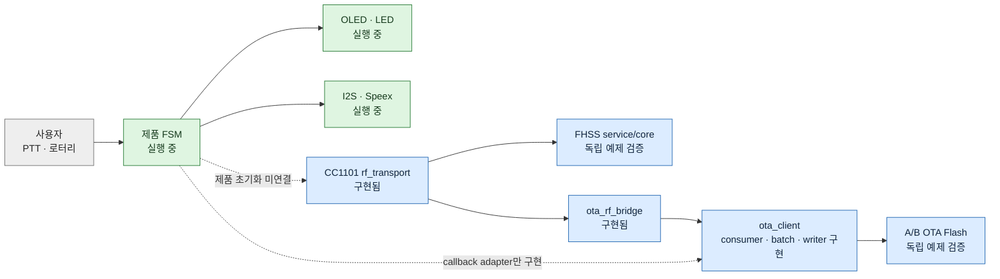
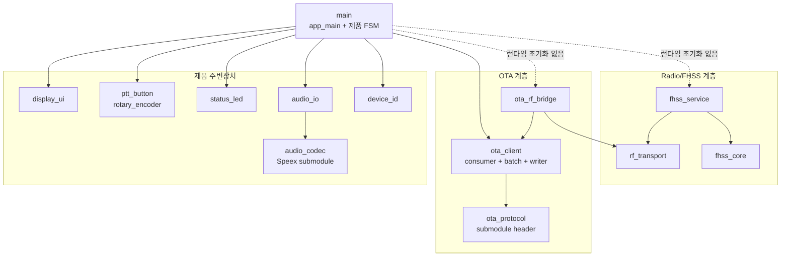
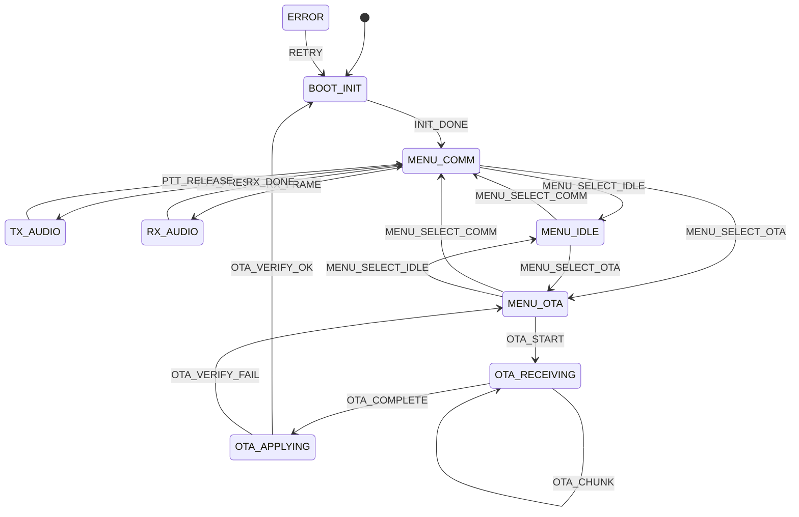
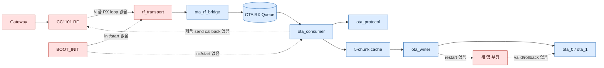

# FHSS OTA 무전기 펌웨어 통합 아키텍처 보고서

> 기준: `feature/ota-rf-receive` 브랜치, `70c8949`, 2026-08-14 코드 상태  
> 빌드 기준: ESP-IDF 6.0.2, ESP32-S3, 16 MiB Flash  
> 목적: 제품 실행 경로와 독립 구현·시험 경로를 구분하고, Audio/FHSS/RF OTA의 현재 통합 상태를 한 문서에서 설명한다.

## 0. 핵심 결론

이 저장소는 ESP32-S3와 CC1101을 사용해 음성 무전, FHSS 동기화, RF 기반 A/B OTA를 하나의 단말에 통합하는 ESP-IDF 프로젝트다.

현재 구현 상태는 다음과 같다.

| 영역 | 구현 상태 | 제품 `app_main()` 연결 |
|---|---|---|
| UI, 버튼, 로터리, LED | 구현 및 제품 실행 | 연결됨 |
| I2S Audio, Speex encode/decode | 구현 및 제품 실행 | 연결됨 |
| CC1101 `rf_transport` | 구현 및 독립 시험 | 미연결 |
| FHSS core/service | 구현 및 2보드 예제 시험 | 미연결 |
| OTA protocol parser/encoder | submodule v0.2 사용 | `ota_client` 내부 연결 |
| OTA consumer/session/batch/writer | 구현 및 실보드 예제 시험 | FSM adapter만 연결, 초기화 미완료 |
| RF → OTA bridge | 구현 | 제품 RX loop 미연결 |
| OTA 완료 후 reboot/rollback 확정 | 미구현 | 미연결 |

따라서 현재 제품 경로는 UI와 Audio까지 실제 실행되고, OTA는 컴파일 의존성과 FSM callback adapter까지 들어왔지만 `BOOT_INIT`에서 `rf_transport_init()`, `ota_client_init()`, `ota_client_start_consumer()`를 호출하지 않는다. 실제 CC1101 RX loop와 ACK/NACK 송신 callback도 아직 없다.



## 1. 빌드와 보드 기준

### 1.1 현재 추적 설정

| 항목 | 현재 값 | 근거 |
|---|---|---|
| ESP-IDF | 6.0.2 | `dependencies.lock` |
| Target | `esp32s3` | `dependencies.lock` |
| Flash | 16 MiB | `sdkconfig.defaults` |
| FreeRTOS tick | 1000 Hz | `sdkconfig.defaults` |
| Partition table | `partitions.csv` | `sdkconfig.defaults` |
| Managed component | `espressif/led_strip` 3.0.3 | `dependencies.lock` |

`sdkconfig`는 로컬 생성 파일이라 Git에서 추적하지 않는다. 새 빌드에서는 `idf.py set-target esp32s3` 후 `sdkconfig.defaults`를 적용해야 한다. 다른 타깃에서 만든 `build-*` 디렉터리는 재사용하지 않는다.

### 1.2 확인된 보드 전제

소스와 핀 설정은 ESP32-S3 계열을 전제로 한다. 주요 S3 전용 또는 주의 핀은 GPIO 38, 41, 42, 46이다.

특히 OLED SCL은 GPIO20이며 ESP32-S3 native USB D+와 겹친다. `display_ui_init()`이 부팅 중 GPIO20을 I2C로 바꾸므로 native USB Serial/JTAG 포트를 사용하는 경우 COM 장치가 사라질 수 있다. 부트 로그와 장시간 monitor는 보드의 USB-UART `COM` 포트를 사용하는 편이 안전하다.

## 2. 저장소 구조

```text
fhss-ota-radio/
├─ CMakeLists.txt
├─ sdkconfig.defaults             ESP32-S3 공통 기본값
├─ partitions.csv                factory + ota_0 + ota_1
├─ dependencies.lock             IDF/managed component 잠금
├─ main/
│  ├─ main.c                     app_main, 임시 CPU 통계 Task
│  ├─ fsm.c/.h                   제품 FSM과 UI/Audio/OTA adapter
│  └─ firmware_version.h         DISCOVER_ACK용 0.1.0
├─ components/
│  ├─ audio_codec/               Speex NB wrapper + Speex submodule
│  ├─ audio_io/                  I2S mic/speaker
│  ├─ device_id/                 eFuse MAC 하위 3바이트 ID
│  ├─ display_ui/                SSD1306 OLED
│  ├─ ptt_button/                PTT polling/debounce
│  ├─ rotary_encoder/            메뉴 cursor/select
│  ├─ status_led/                WS2812 상태 표시
│  ├─ rf_transport/              CC1101 SPI/FIFO/GDO0
│  ├─ fhss_core/                 FHSS 계산 로직
│  ├─ fhss_service/              RF + FHSS + FreeRTOS Task
│  ├─ ota_protocol/              ota-protocol submodule 공개
│  ├─ ota_client/                consumer/session/batch/writer
│  └─ ota_rf_bridge/             RF payload → OTA Queue adapter
├─ examples/
│  ├─ fhss_sync_test/            2보드 FHSS TX/RX 시험
│  └─ ota_queue_copy_test/       RF 없는 OTA protocol/Flash 시험
└─ docs/
```

### 2.1 Git submodule

프로젝트는 외부 코드를 두 개의 submodule로 고정한다.

| 경로 | 저장소 역할 | 현재 커밋 |
|---|---|---|
| `components/audio_codec/speex` | Speex 1.2.1 계열 codec | `0589522` |
| `components/ota_protocol/upstream` | ESP32와 Gateway 공유 wire format | `9d2aa2b` |

부모 저장소는 submodule 파일을 직접 저장하지 않고 커밋 포인터만 저장한다. 재현 가능한 빌드를 위해 clone 후 `git submodule update --init --recursive`가 필요하다.

## 3. 계층과 컴포넌트 의존성



`main/CMakeLists.txt`는 `ota_client`와 `device_id`를 직접 의존한다. 하지만 CMake 의존성은 링크 가능성을 의미할 뿐 실제 초기화를 의미하지 않는다. `main`은 여전히 `ota_rf_bridge`, `rf_transport`, `fhss_service`를 의존하거나 호출하지 않는다.

## 4. 제품 부팅과 FSM

### 4.1 `app_main()`

현재 진입점은 다음 순서다.

```text
app_main()
├─ fsm_init()
│  ├─ FSM event Queue 생성, depth 16
│  ├─ RX audio Queue 생성, depth 4
│  └─ fsm_task 생성
├─ task_stats_task 생성
│  └─ sdkconfig 통계 옵션이 켜졌을 때만, priority idle+10
└─ FSM_EVENT_INIT_DONE post
```

`fsm_task`는 시작하면서 `BOOT_INIT` 진입 동작을 실행한다. `BOOT_INIT`은 eFuse 기반 device ID를 로그로 출력하고 다음 모듈을 최초 한 번 초기화한다.

```text
display_ui
status_led
ptt_button + callback
rotary_encoder + callbacks
audio_codec
audio_io
```

`ERROR → RETRY → BOOT_INIT` 재진입 때 하드웨어를 중복 초기화하지 않도록 `s_boot_init_done`을 사용한다.

### 4.2 제품 FSM 상태

| 상태 | 책임 |
|---|---|
| `BOOT_INIT` | device ID 출력, 주변장치 최초 초기화 |
| `MENU_COMM` | 음성 통신 대기 |
| `MENU_IDLE` | 뮤트 또는 임시 loopback 시험 |
| `MENU_OTA` | OTA DISCOVER/START 허용 모드 |
| `TX_AUDIO` | 마이크 캡처와 Speex encode |
| `RX_AUDIO` | Speex decode와 스피커 재생 |
| `OTA_RECEIVING` | OTA 세션 진행을 표시할 제품 상태 |
| `OTA_APPLYING` | 이미지 검증/적용을 표시할 제품 상태 |
| `ERROR` | LED 점멸, OLED ERROR |



`ERROR`는 대부분의 상태에서 전역 진입할 수 있다. `SYNC_LOST`도 `BOOT_INIT`과 `ERROR`를 제외한 상태를 `MENU_COMM`으로 강제 복귀시키는 전역 처리다.

### 4.3 OTA FSM adapter

`fsm_ota_mode_callback()`과 `fsm_ota_event_callback()`은 구현됐다.

| OTA client event | 제품 FSM 처리 |
|---|---|
| `STARTED` | `OTA_START` post |
| `PROGRESS` | 진행률 로그 |
| `APPLYING` | `OTA_COMPLETE` post |
| `COMPLETED` | `OTA_VERIFY_OK` post |
| `FAILED` | applying이면 `OTA_VERIFY_FAIL`, 아니면 `ERROR` |
| `ABORTED` | 중단 진행률 로그 |

하지만 제품에서 `ota_client_init()`을 호출하지 않아 callback이 아직 등록되지 않는다. `on_enter_ota_receiving()`과 `on_enter_ota_applying()`도 현재 TODO다.

추가로 `OTA_VERIFY_OK → BOOT_INIT`과 `ERROR → RETRY → BOOT_INIT` 재진입 뒤에는 `INIT_DONE`을 다시 post하는 코드가 없다. 따라서 이 전이가 실제로 발생하면 별도 초기화 완료 이벤트가 오기 전까지 FSM이 `BOOT_INIT`에 머문다. 재부팅으로 끝낼지, 재진입 시 `INIT_DONE`을 다시 발생시킬지 정책을 확정해야 한다.

## 5. FreeRTOS 실행 객체

| 종류 | 이름 | 생성 위치 | 용도 | 제품 실행 |
|---|---|---|---|---|
| Queue | FSM event, depth 16 | `fsm_init()` | 상태 이벤트 직렬화 | 예 |
| Queue | RX audio, depth 4 | `fsm_init()` | encoded frame 값 복사 | 예, RF producer 없음 |
| Queue | RF timestamp, depth 1 | `rf_transport_init()` | GDO0 최신 timestamp | 제품에서는 아니오 |
| Queue | OTA RX, depth 16 | `ota_client_init()` | 최대 60B packet 값 복사 | 제품에서는 아니오 |
| Task | `fsm_task` | `fsm_init()` | 제품 FSM | 예 |
| Task | PTT polling | `ptt_button_init()` | debounce/callback | 예 |
| Task | Rotary polling | `rotary_encoder_init()` | cursor/select | 예 |
| Task | `tx_audio` | `TX_AUDIO` 진입 | 20ms capture/encode | 동적 |
| Task | `rx_audio` | `RX_AUDIO` 진입 | decode/play | 동적 |
| Task | `mic_test` | MENU_IDLE + PTT | 임시 loopback | `LOOPBACK_ENABLE`로 현재 활성 |
| Task | `task_stats` | `app_main()` | 2초 CPU 통계 | defaults 적용 시 예 |
| Task | `fhss_service` | `fhss_service_start()` | TX/RX hopping | 예제에서만 |
| Task | `ota_consumer` | `ota_client_start_consumer()` | Queue decode/ACK/NACK | 예제에서만 |

`fhss_service`는 진단 snapshot 보호용 mutex를 하나 사용한다.

## 6. Audio 경로

### 6.1 송신

```text
PTT press
→ MENU_COMM → TX_AUDIO
→ speaker beep
→ tx_audio Task
→ INMP441 I2S RX, 160 samples / 20ms
→ Speex narrowband encode, 최대 64B
→ TODO: FHSS/rf_transport 송신
```

### 6.2 수신

```text
향후 RF/FHSS 수신자
→ fsm_post_rx_audio_frame()
→ RX audio Queue 값 복사
→ MENU_COMM → RX_AUDIO
→ Speex decode
→ MAX98357A I2S TX
→ 1초간 새 frame 없으면 RX_DONE
```

수신 Queue와 재생 경로는 구현됐지만 RF/FHSS가 `fsm_post_rx_audio_frame()`을 호출하는 연결은 없다. 코드 일부 주석에는 `rf_transport`가 “아직 없음”이라고 적혀 있지만 실제 컴포넌트는 존재하며, 정확한 상태는 “제품 연결이 없음”이다.

## 7. RF Transport와 FHSS

### 7.1 `rf_transport`

- CC1101 SPI mode 0 제어
- 433.92 MHz, 38.4 kBaud, 2-FSK, variable-length packet, hardware CRC
- RF payload 최대 60B
- 채널 설정, RX 시작, packet TX/RX
- RSSI, LQI, CRC status 추출
- GDO0 rising edge를 ISR에서 depth-1 Queue로 전달

### 7.2 `fhss_core`

| 모듈 | 역할 |
|---|---|
| `fhss_hop_sequence` | slot에서 hop index/channel 계산 |
| `fhss_slot_scheduler` | slot 시작과 다음 전환 시각 계산 |
| `fhss_sync_packet` | 13B SYNC encode/decode |
| `fhss_timing_window` | 예상/실제 수신 시각 평가 |
| `fhss_sync_state` | 연속 성공/실패 기반 획득·상실 |
| `fhss_sync_controller` | scheduler와 sync state 결합 |
| `fhss_core` | facade |

### 7.3 `fhss_service`

`fhss_service`는 `rf_transport`, `fhss_core`, 자체 FHSS FSM, FreeRTOS Task를 묶는다. 현재 API는 init/start/state/diagnostics이고 stop이나 런타임 role 변경 API는 없다.

`examples/fhss_sync_test`는 다음 설정으로 고정 TX 또는 RX를 시험한다.

```text
SPI: SCLK12, MOSI11, MISO13, CS14
GDO0: GPIO9
channels: 0, 10, 20
slot: 300ms
guard: 5ms
search dwell: 137ms
RX timeout: 80ms
acquire/loss: 3/5
diagnostics: 5초
```

제품 통합에는 radio 소유권, 음성 TX/RX role 전환, FHSS stop/resume, OTA 중 음성 hopping 일시정지 정책이 필요하다.

## 8. OTA 구조

### 8.1 protocol 소유권

wire format은 `components/ota_protocol/upstream`의 header-only submodule이 정의한다. ESP32와 Gateway가 같은 커밋을 사용해야 한다.

| Packet | 크기 | 방향 | 핵심 필드 |
|---|---:|---|---|
| DISCOVER | 1B | Gateway → broadcast | type |
| DISCOVER_ACK | 7B | ESP32 → Gateway | 24-bit device ID, fw 3바이트 |
| START | 49B | Gateway → ESP32 | session, target, size, chunks, SHA-256 |
| DATA | 12~60B | Gateway → ESP32 | session, sequence, length, CRC16, payload≤48B |
| END | 13B | Gateway → ESP32 | session, size, chunks |
| ACK/NACK | 11B | ESP32 → Gateway | session, ack type, sequence, result |

모든 다중 바이트 정수는 Little Endian이다. DATA payload CRC-16/CCITT-FALSE는 CC1101 hardware CRC와 별개의 application 검증이다.

### 8.2 `ota_client` 상태

```text
UNINITIALIZED
→ IDLE
→ RECEIVING
→ VERIFYING
→ READY_TO_REBOOT

오류 시 ERROR
abort 후 IDLE
```

### 8.3 consumer 동작

`ota_consumer` Task는 OTA RX Queue를 기다리고 packet type별로 처리한다.

- `DISCOVER`: 제품이 `MENU_OTA`일 때만 `DISCOVER_ACK`
- `START`: target/session/size/chunks 검증 후 writer begin, ACK/NACK
- `DATA`: exact length, CRC, session, sequence, chunk length 검증 후 cache 저장, ACK/NACK
- `END`: 수신 완료 여부, size/chunks, image validation, SHA-256 검증 후 ACK/NACK
- timeout: 현재 batch의 missing sequence마다 `TIMEOUT NACK`
- 수신된 ACK/NACK/DISCOVER_ACK: Gateway 방향이므로 무시

### 8.4 Queue와 batch cache

OTA RX Queue와 batch cache는 목적이 다르다.

| 구조 | 크기 | 목적 |
|---|---|---|
| FreeRTOS OTA RX Queue | 16 × `{data[60], length}` | RF producer와 consumer 분리, packet 값 복사 |
| `ota_batch_cache_t` | 5 × 48B + bitmap | out-of-order DATA 재조립과 Flash 쓰기 묶음 |

배치가 완성되면 최대 240B 연속 buffer를 `esp_ota_write()` 한 번으로 기록한다. 이전 배치의 중복 DATA는 Flash에 다시 쓰지 않고 성공으로 처리해 ACK 재전송을 허용한다. 마지막 배치는 남은 chunk 수만 요구한다.

### 8.5 writer 검증 순서

```text
esp_ota_get_next_update_partition()
→ esp_ota_begin(image_size)
→ 배치별 esp_ota_write()
→ written_size == image_size 확인
→ esp_ota_end(): ESP image 검증
→ esp_partition_get_sha256()
→ START의 expected SHA-256과 비교
→ esp_ota_set_boot_partition()
→ READY_TO_REBOOT
```

SHA-256 비교는 구현됐다. 그러나 `esp_restart()`, 새 앱의 `esp_ota_mark_app_valid_cancel_rollback()`, 실패 시 rollback 처리는 아직 제품 코드에 없다.

### 8.6 제품 통합의 정확한 단절점



## 9. Flash 파티션

현재 파티션은 Flash 앞쪽 8 MiB만 사용한다. 실물 및 defaults는 16 MiB이므로 상위 8 MiB는 미사용이다.

| 이름 | Offset | 크기 | 역할 |
|---|---:|---:|---|
| `nvs` | `0x009000` | 16 KiB | NVS |
| `otadata` | `0x00D000` | 8 KiB | OTA 선택 정보 |
| `phy_init` | `0x00F000` | 4 KiB | PHY data |
| `factory` | `0x010000` | 1 MiB | factory app |
| `ota_0` | `0x110000` | 3 MiB | OTA slot 0 |
| `ota_1` | `0x410000` | 3 MiB | OTA slot 1 |
| `storage` | `0x710000` | 960 KiB | SPIFFS |

끝 주소는 `0x800000`이다.

## 10. 핀맵과 충돌 위험

| 기능 | GPIO |
|---|---|
| PTT | 1 |
| Rotary A/B/SW | 2 / 42 / 41 |
| Mic WS/BCLK/SD | 4 / 5 / 6 |
| Speaker BCLK/WS/DOUT | 3 / 46 / 8 |
| Speaker GAIN/SD | 18 / 17 |
| OLED SDA/SCL | 21 / 20 |
| WS2812 LED | 38 |
| CC1101 시험 SPI | 12 / 11 / 13 / 14 |
| CC1101 시험 GDO0 | 9 |

주의 사항:

- GPIO20은 native USB D+와 충돌한다.
- GPIO3과 GPIO46은 boot strapping/JTAG 관련 조건을 검토해야 한다.
- GPIO38 LED는 보드 revision에 따라 GPIO48일 수 있다.
- 제품 코드에는 CC1101 핀 구성이 아직 들어오지 않았다.

## 11. 독립 시험 범위

### 11.1 `fhss_sync_test`

- 고정 TX/RX role
- CC1101 SPI/GDO0
- SYNC packet과 hopping
- acquire/loss 판정
- diagnostics snapshot

제품 FSM, Audio, OTA와는 별도 앱이다.

### 11.2 `ota_queue_copy_test`

현재 예제는 다음을 검증한다.

- 60B 원본 buffer 재사용 후 Queue 값 복사
- packet 길이 검증과 Queue capacity
- DATA payload 최대 48B
- versionless DISCOVER/DISCOVER_ACK
- START size/chunk 검증
- 5청크 out-of-order, 개별 ACK, 선택 재전송
- CRC NACK, missing sequence timeout NACK
- duplicate DATA ACK 재전송과 Flash 중복 기록 방지
- 배치당 단일 writer 호출과 부분 마지막 배치
- 실제 OTA partition write
- 잘린 이미지의 END `VERIFY_FAILED NACK`
- abort 후 IDLE 복귀
- `TEST_CSV` 출력과 PowerShell collector

이 시험은 RF 없이 Queue에 protocol packet을 직접 제출한다. 따라서 Pi–CC1101–ESP32 end-to-end 검증을 대신하지 않는다.

## 12. 현재 구현 상태판

### 제품에서 실행 중

- 제품 FSM과 UI 입력
- OLED, LED, PTT, 로터리
- I2S mic/speaker와 Speex
- device ID 로그
- 임시 CPU runtime stats

### 구현·독립 검증됐지만 제품 미연결

- `rf_transport`
- `fhss_core`, `fhss_service`
- `ota_protocol` v0.2 parser/encoder
- OTA Queue consumer
- session/CRC/sequence/timeout ACK/NACK
- 5청크 batch cache
- 실제 OTA partition write와 잘린 이미지 검증 실패 경로
- 전체 SHA-256 비교와 boot partition 설정 코드(정상 이미지 성공 경로는 추가 실보드 검증 필요)
- `ota_rf_bridge`
- OTA event ↔ 제품 FSM adapter

### 남은 통합 작업

1. 제품에서 CC1101 단일 소유자와 mode arbitration 정의
2. `BOOT_INIT`에서 RF/OTA 초기화 및 consumer 시작
3. RF RX loop에서 audio/FHSS/OTA packet 분류
4. OTA response를 보내는 실제 `send_callback`
5. Audio encode frame의 FHSS/RF 송신과 수신 callback 연결
6. OTA 완료 후 restart
7. 새 앱 health check, valid 확정, rollback
8. `BOOT_INIT` 재진입 후 `INIT_DONE` 처리 정책 확정
9. GPIO20/native USB 충돌 해결
10. Gateway–CC1101–ESP32 E2E 시험과 장애 주입

## 13. 문서 해석 규칙

이 프로젝트에서는 다음 표현을 구분한다.

- **구현됨**: 함수와 컴포넌트가 존재한다.
- **독립 검증됨**: example 또는 실보드 시험에서 실행됐다.
- **제품 연결됨**: 루트 `app_main()`에서 초기화되고 실제 실행 경로가 있다.
- **E2E 검증됨**: Gateway부터 RF와 Flash/재부팅까지 전체 경로가 검증됐다.

OTA consumer와 writer는 “구현·독립 검증됨”이지만 아직 “제품 연결됨”이나 “E2E 검증됨”은 아니다.

## 14. 핵심 파일 색인

| 관심사 | 파일 |
|---|---|
| 제품 진입점 | `main/main.c` |
| 제품 FSM/OTA adapter | `main/fsm.c`, `main/fsm.h` |
| 버전 | `main/firmware_version.h` |
| CC1101 | `components/rf_transport/rf_transport.c` |
| FHSS | `components/fhss_core/*`, `components/fhss_service/*` |
| OTA public API | `components/ota_client/include/ota_client.h` |
| OTA consumer | `components/ota_client/source/ota_consumer.c` |
| OTA session | `components/ota_client/source/ota_client.c` |
| Batch cache | `components/ota_client/source/ota_batch_cache.c` |
| Flash writer | `components/ota_client/source/ota_writer.c` |
| Wire protocol | `components/ota_protocol/upstream/include/ota_protocol.h` |
| RF/OTA bridge | `components/ota_rf_bridge/ota_rf_bridge.c` |
| OTA 시험 | `examples/ota_queue_copy_test/main/main.c` |
| FHSS 시험 | `examples/fhss_sync_test/main/main.c` |
| Build defaults | `sdkconfig.defaults`, `dependencies.lock` |
| Partition | `partitions.csv` |
