# FHSS OTA Radio Firmware — 런타임 데이터 흐름과 마인드맵

> 기준: `feature/ota-rf-receive` (`70c8949`), 2026-08-14  
> 범위: 현재 제품 실행 경로, 독립 시험 경로, 아직 연결되지 않은 경계를 함께 표시한다.

## 상태 범례

| 표시 | 의미 |
|---|---|
| 🟢 제품 실행 | 루트 `app_main()`에서 초기화되어 실행됨 |
| 🔵 독립 검증 | 컴포넌트/예제에서 실행·검증됐으나 제품 미연결 |
| 🟡 구현 | 코드와 API는 있으나 제품 실행 또는 E2E 검증이 없음 |
| 🔴 단절 | 통합 코드, hardware loop, reboot/rollback 등이 없음 |

## A. 전체 아키텍처 마인드맵

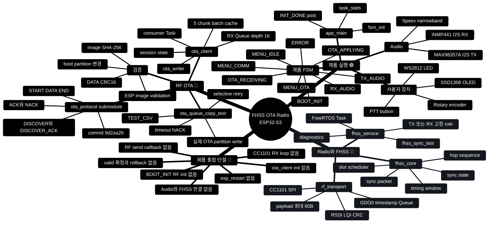

## B. 제품 부팅과 FSM

### B-1. 실제 부팅 순서

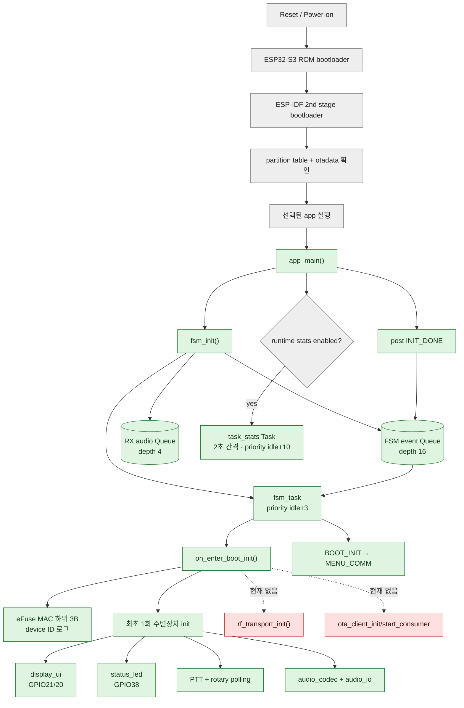

GPIO20은 native USB D+다. 제품 부팅에서 `display_ui_init()`이 GPIO20을 I2C SCL로 전환하므로 보드의 native `USB` 포트를 monitor에 사용하면 COM 포트가 사라질 수 있다. boot/runtime 증거 수집에는 USB-UART `COM` 포트를 우선 사용한다.

### B-2. 제품 FSM 전이

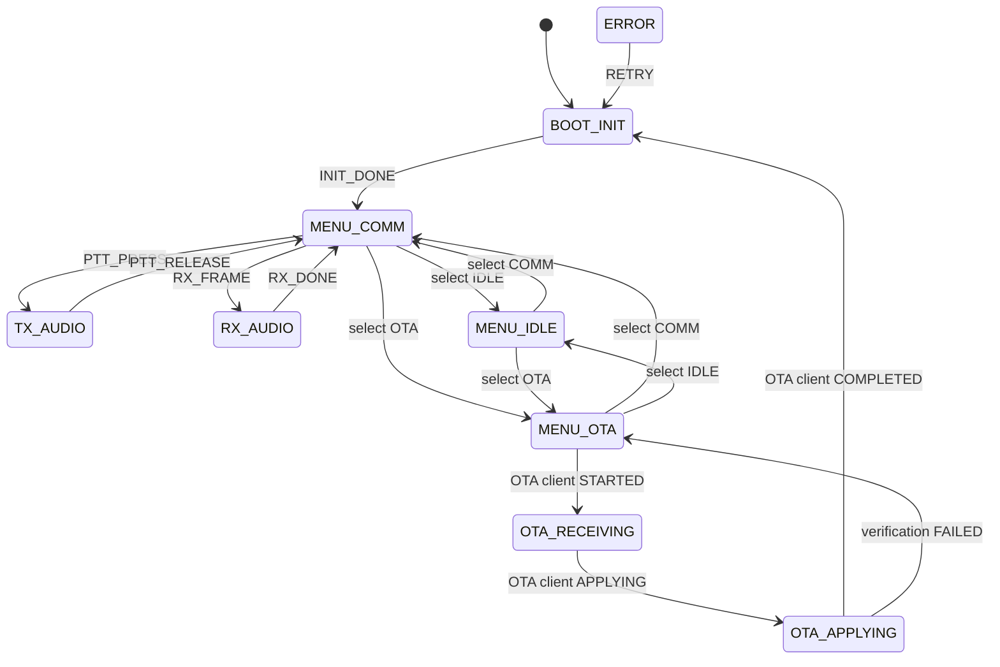

전역 처리:

- `ERROR`: `BOOT_INIT`을 제외한 정상 상태에서 ERROR로 이동 가능
- `SYNC_LOST`: `BOOT_INIT`과 `ERROR` 이외의 상태에서 `MENU_COMM`으로 복귀
- 메뉴 변경: `MENU_COMM`, `MENU_IDLE`, `MENU_OTA` 사이에서만 허용
- `OTA_START`: `MENU_OTA`에서만 유효
- `PTT_PRESS`, `RX_FRAME`: `MENU_COMM`에서만 유효

OTA event adapter는 구현됐지만 제품에서 `ota_client_init()`에 등록하지 않았기 때문에 위 OTA 전이는 현재 실제품 실행 경로에서 발생하지 않는다.

또한 `OTA_VERIFY_OK` 또는 `RETRY`로 `BOOT_INIT`에 재진입한 뒤 `INIT_DONE`을 다시 post하는 코드는 없다. 현재 전이표 그대로 실제 이벤트가 들어오면 FSM은 `BOOT_INIT`에 머무르므로, OTA 성공 시 즉시 reboot할지 또는 재초기화 완료 이벤트를 다시 올릴지 결정해야 한다.

## C. Audio 데이터 흐름

### C-1. 송신

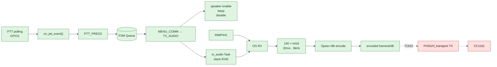

### C-2. 수신

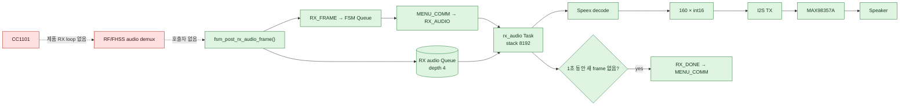

### C-3. 임시 loopback

`LOOPBACK_ENABLE`이 현재 정의돼 있다. `MENU_IDLE`에서 PTT를 누르면 정식 FSM 전이 대신 `mic_test` Task가 mic → Speex encode/decode → buffer에 저장하고 PTT release 뒤 재생한다. 이 경로는 제품 음성 RF 경로가 아니다.

## D. RF Transport와 FHSS

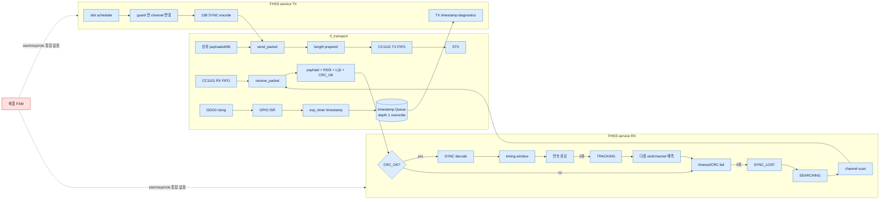

FHSS 경로는 `examples/fhss_sync_test`에서 실행된다. 제품 FSM에는 `fhss_service_init()`과 `fhss_service_start()` 호출이 없다.

## E. RF OTA 전체 흐름

### E-1. 목표 흐름과 현재 경계

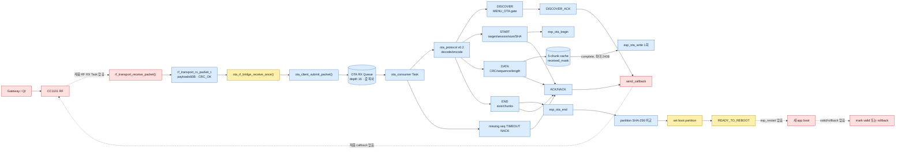

파란 노드는 컴포넌트 또는 `ota_queue_copy_test`에서 검증됐다. 빨간 연결은 제품에서 아직 없다.

### E-2. OTA client 상태

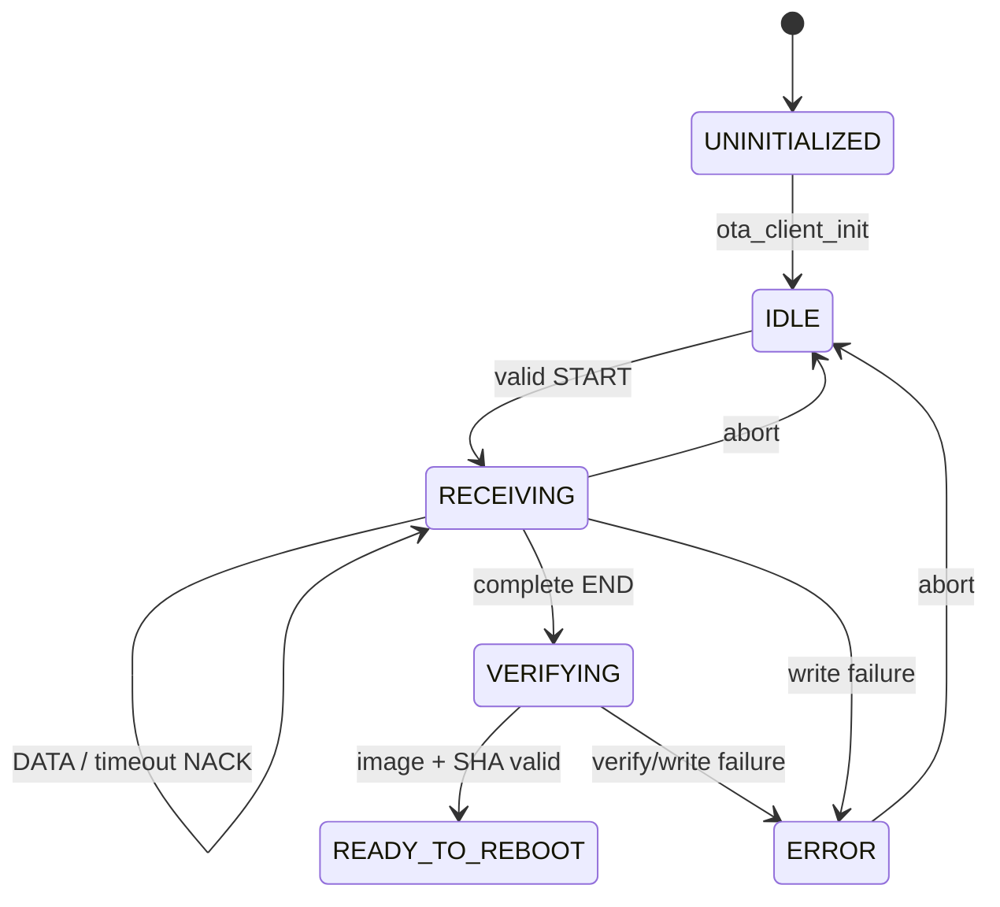

### E-3. OTA packet 크기

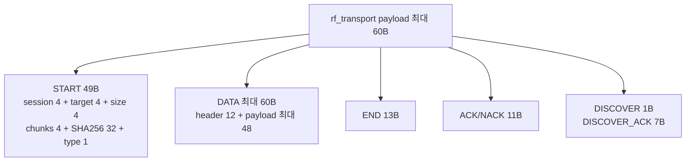

### E-4. Queue와 5청크 cache

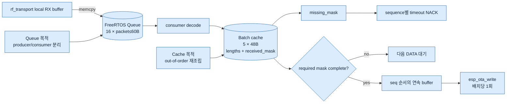

### E-5. 선택 재전송 sequence

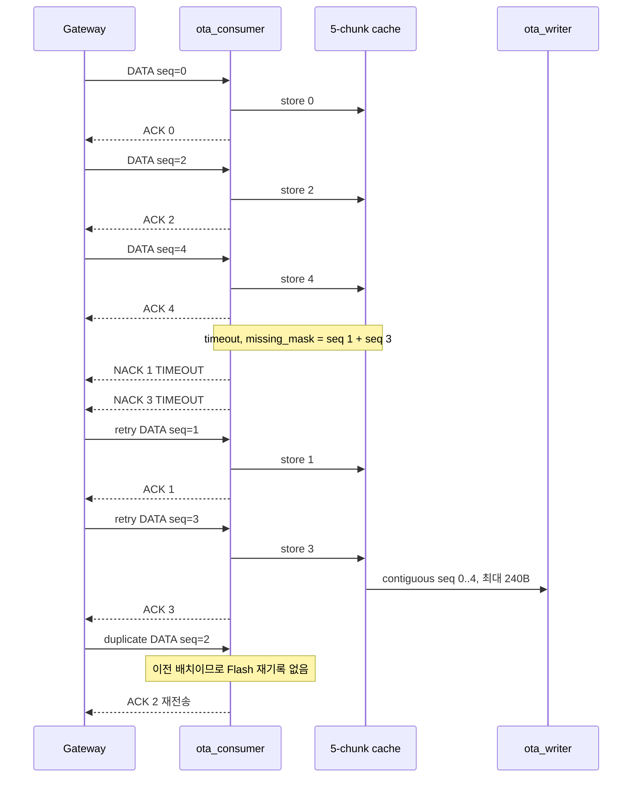

### E-6. 마지막 부분 배치

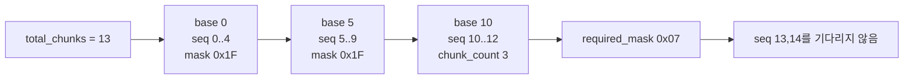

### E-7. END 검증과 아직 없는 부팅 확정

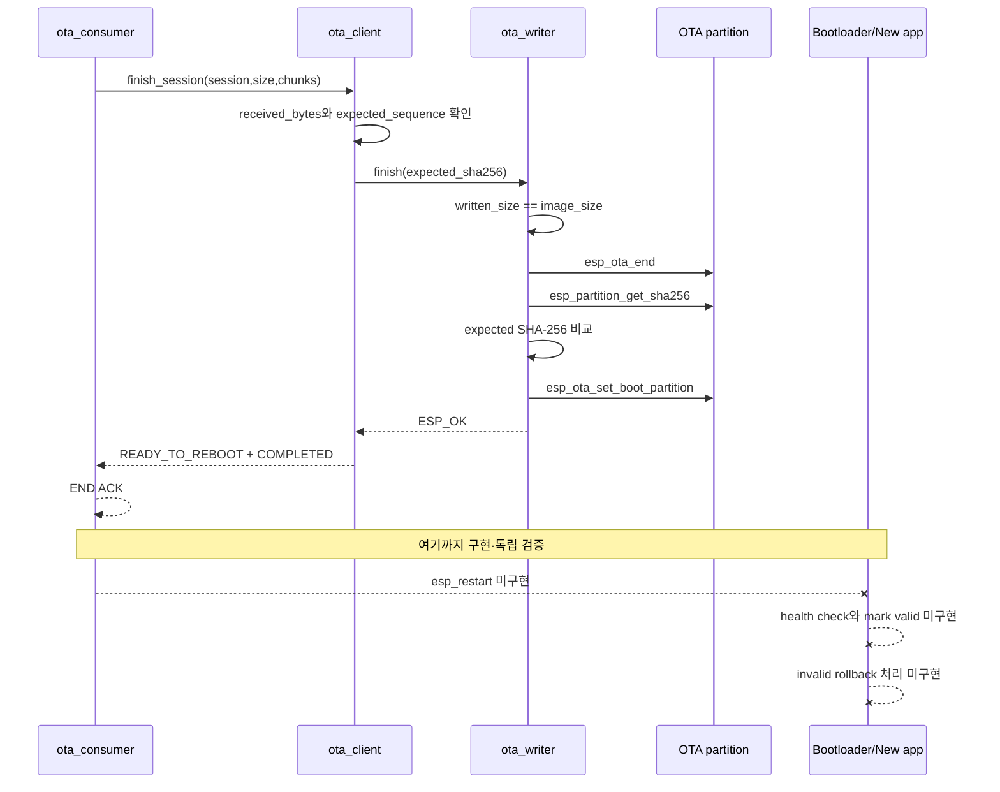

## F. A/B Flash 배치

```mermaid
flowchart LR
  BL["bootloader / partition table<br/>0x000000..0x008FFF"] --> NVS["nvs<br/>0x009000 · 16KiB"]
  NVS --> OD["otadata<br/>0x00D000 · 8KiB"]
  OD --> PHY["phy_init<br/>0x00F000 · 4KiB"]
  PHY --> FACT["factory<br/>0x010000 · 1MiB"]
  FACT --> O0["ota_0<br/>0x110000 · 3MiB"]
  O0 --> O1["ota_1<br/>0x410000 · 3MiB"]
  O1 --> STORE["storage<br/>0x710000 · 960KiB"]
  STORE --> USED["0x800000<br/>앞쪽 8MiB 사용"]
  USED -.-> FREE["0x800000..0xFFFFFF<br/>16MiB Flash 상위 절반 미사용"]
```

## G. FreeRTOS producer–consumer 표

| 객체 | Producer/생성자 | Consumer | 현재 상태 |
|---|---|---|---|
| FSM event Queue, depth 16 | UI callback, `app_main`, OTA adapter | `fsm_task` | 🟢 제품 실행 |
| RX audio Queue, depth 4 | `fsm_post_rx_audio_frame()` | `rx_audio` | 🟢 Queue/consumer, 🔴 RF producer 없음 |
| RF timestamp Queue, depth 1 | GDO0 ISR | `fhss_service` | 🔵 FHSS 예제 |
| OTA RX Queue, depth 16 | `ota_client_submit_packet()` / bridge | `ota_consumer` | 🔵 OTA 예제, 🔴 제품 init 없음 |
| `fsm_task` | `fsm_init()` | — | 🟢 |
| PTT Task | `ptt_button_init()` | — | 🟢 |
| Rotary Task | `rotary_encoder_init()` | — | 🟢 |
| `tx_audio` | `TX_AUDIO` 진입 | — | 🟢 encode까지, 🔴 RF TX 없음 |
| `rx_audio` | `RX_AUDIO` 진입 | — | 🟢 decode/play, 🔴 RF source 없음 |
| `mic_test` | MENU_IDLE + PTT | — | 🟢 임시 기능 |
| `task_stats` | `app_main()` | — | 🟢 defaults 적용 시 |
| `fhss_service` | `fhss_service_start()` | — | 🔵 예제 |
| `ota_consumer` | `ota_client_start_consumer()` | OTA Queue | 🔵 예제 |

Batch cache는 Task도 Queue도 아니다. `ota_client_context_t`가 소유하는 고정 SRAM 구조체다.

## H. 제품 통합 시 필요한 최종 연결

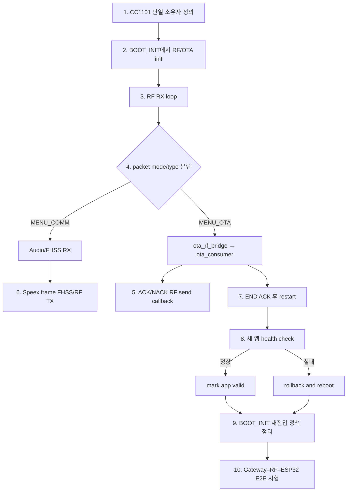

## I. 구현 상태 요약

### 🟢 제품 실행

- 제품 FSM, FSM Queue, Audio Queue
- OLED, PTT, 로터리, WS2812
- device ID 로그
- I2S mic/speaker와 Speex encode/decode
- 임시 loopback 및 CPU runtime stats

### 🔵 독립 검증

- CC1101 transport와 FHSS service
- ota-protocol v0.2 decode/encode
- OTA consumer Task와 mode gate
- START/DATA/END ACK/NACK
- CRC, sequence, timeout, duplicate 처리
- 5청크 batch와 단일 Flash write
- 실제 OTA partition write와 잘린 이미지의 validation 실패
- abort 복구와 TEST_CSV collector

### 🟡 구현됐지만 제품 미연결

- `ota_rf_bridge`
- OTA event ↔ 제품 FSM adapter
- `main`의 `ota_client` compile dependency
- 전체 SHA-256 비교와 boot partition 설정의 정상 이미지 성공 경로

### 🔴 남은 작업

- 제품 CC1101/FHSS/OTA 초기화
- 실제 RF RX loop와 OTA response 송신
- Audio와 FHSS 연결
- radio mode arbitration
- `esp_restart()`
- 새 app valid 확정과 rollback
- `BOOT_INIT` 재진입 후 `INIT_DONE` 처리
- GPIO20/native USB 충돌 해결
- 전체 E2E/장애 주입 검증

## 근거 파일

- 부팅/FSM: `main/main.c`, `main/fsm.c`, `main/fsm.h`
- 제품 버전: `main/firmware_version.h`
- Audio/UI: `components/audio_io/*`, `components/audio_codec/*`, `components/display_ui/*`
- Device ID: `components/device_id/*`
- RF/FHSS: `components/rf_transport/*`, `components/fhss_core/*`, `components/fhss_service/*`
- OTA wire: `components/ota_protocol/upstream/include/ota_protocol.h`
- OTA 실행: `components/ota_client/source/*`
- RF bridge: `components/ota_rf_bridge/*`
- OTA 시험: `examples/ota_queue_copy_test/*`
- FHSS 시험: `examples/fhss_sync_test/*`
- Build/Flash: `dependencies.lock`, `sdkconfig.defaults`, `partitions.csv`
